# OLED

### OLED-GPIO的设置方式

```c
void OLED_GPIO_Init(void)
{
	uint32_t i, j;
	
	/*在初始化前，加入适量延时，待OLED供电稳定*/
	for (i = 0; i < 1000; i ++)
	{
		for (j = 0; j < 1000; j ++);
	}
	
	/*将SCL和SDA引脚初始化为开漏模式*/
    RCC_APB2PeriphClockCmd(RCC_APB2Periph_GPIOB, ENABLE);
	
	GPIO_InitTypeDef GPIO_InitStructure;
 	GPIO_InitStructure.GPIO_Mode = GPIO_Mode_Out_OD;
	GPIO_InitStructure.GPIO_Speed = GPIO_Speed_50MHz;
	GPIO_InitStructure.GPIO_Pin = OLED_SCL_PIN;
 	GPIO_Init(GPIOB, &GPIO_InitStructure);
	GPIO_InitStructure.GPIO_Pin = OLED_SDA_PIN;
 	GPIO_Init(GPIOB, &GPIO_InitStructure);
	
	/*释放SCL和SDA*/
	OLED_W_SCL(1);
	OLED_W_SDA(1);
}
```

**将SCL和SDA引脚初始化为开漏模式**---！！！！2024年3月1日记住

```

GPIO_InitStructure.GPIO_Mode = GPIO_Mode_Out_OD;
```


### 数组名的配置

.h

```c
#ifndef __OLED_DATA_H
#define __OLED_DATA_H

#include <stdint.h>

/*中文字符字节宽度*/
#define OLED_CHN_CHAR_WIDTH			3		//UTF-8编码格式给3，GB2312编码格式给2

/*字模基本单元*/
typedef struct 
{
	char Index[OLED_CHN_CHAR_WIDTH + 1];	//汉字索引
	uint8_t Data[32];						//字模数据
} ChineseCell_t;

/*ASCII字模数据声明*/
extern const uint8_t OLED_F8x16[][16];
extern const uint8_t OLED_F6x8[][6];

/*汉字字模数据声明*/
extern const ChineseCell_t OLED_CF16x16[];

/*图像数据声明*/
extern const uint8_t Diode[];
/*按照上面的格式，在这个位置加入新的图像数据声明*/
//...

#endif


/*****************江协科技|版权所有****************/
/*****************jiangxiekeji.com*****************/

```


#### .c

```c
#include "OLED_Data.h"

/**
  * 数据存储格式：
  * 纵向8点，高位在下，先从左到右，再从上到下
  * 每一个Bit对应一个像素点
  * 
  *      B0 B0                  B0 B0
  *      B1 B1                  B1 B1
  *      B2 B2                  B2 B2
  *      B3 B3  ------------->  B3 B3 --
  *      B4 B4                  B4 B4  |
  *      B5 B5                  B5 B5  |
  *      B6 B6                  B6 B6  |
  *      B7 B7                  B7 B7  |
  *                                    |
  *  -----------------------------------
  *  |   
  *  |   B0 B0                  B0 B0
  *  |   B1 B1                  B1 B1
  *  |   B2 B2                  B2 B2
  *  --> B3 B3  ------------->  B3 B3
  *      B4 B4                  B4 B4
  *      B5 B5                  B5 B5
  *      B6 B6                  B6 B6
  *      B7 B7                  B7 B7
  * 
  */

/*ASCII字模数据*********************/

/*宽8像素，高16像素*/
const uint8_t OLED_F8x16[][16] =
{
	0x00,0x00,0x00,0x00,0x00,0x00,0x00,0x00,
	0x00,0x00,0x00,0x00,0x00,0x00,0x00,0x00,//   0
	0x00,0x00,0x00,0xF8,0x00,0x00,0x00,0x00,
	0x00,0x00,0x00,0x33,0x30,0x00,0x00,0x00,// ! 1
	0x00,0x16,0x0E,0x00,0x16,0x0E,0x00,0x00,
	0x00,0x00,0x00,0x00,0x00,0x00,0x00,0x00,// " 2
	0x40,0xC0,0x78,0x40,0xC0,0x78,0x40,0x00,
	0x04,0x3F,0x04,0x04,0x3F,0x04,0x04,0x00,// # 3
	0x00,0x70,0x88,0xFC,0x08,0x30,0x00,0x00,
	0x00,0x18,0x20,0xFF,0x21,0x1E,0x00,0x00,// $ 4
	0xF0,0x08,0xF0,0x00,0xE0,0x18,0x00,0x00,
	0x00,0x21,0x1C,0x03,0x1E,0x21,0x1E,0x00,// % 5
	0x00,0xF0,0x08,0x88,0x70,0x00,0x00,0x00,
	0x1E,0x21,0x23,0x24,0x19,0x27,0x21,0x10,// & 6
	0x00,0x00,0x00,0x16,0x0E,0x00,0x00,0x00,
	0x00,0x00,0x00,0x00,0x00,0x00,0x00,0x00,// ' 7
	0x00,0x00,0x00,0xE0,0x18,0x04,0x02,0x00,
	0x00,0x00,0x00,0x07,0x18,0x20,0x40,0x00,// ( 8
	0x00,0x02,0x04,0x18,0xE0,0x00,0x00,0x00,
	0x00,0x40,0x20,0x18,0x07,0x00,0x00,0x00,// ) 9
	0x40,0x40,0x80,0xF0,0x80,0x40,0x40,0x00,
	0x02,0x02,0x01,0x0F,0x01,0x02,0x02,0x00,// * 10
	0x00,0x00,0x00,0xF0,0x00,0x00,0x00,0x00,
	0x01,0x01,0x01,0x1F,0x01,0x01,0x01,0x00,// + 11
	0x00,0x00,0x00,0x00,0x00,0x00,0x00,0x00,
	0x00,0xB0,0x70,0x00,0x00,0x00,0x00,0x00,// , 12
	0x00,0x00,0x00,0x00,0x00,0x00,0x00,0x00,
	0x00,0x01,0x01,0x01,0x01,0x01,0x01,0x01,// - 13
	0x00,0x00,0x00,0x00,0x00,0x00,0x00,0x00,
	0x00,0x30,0x30,0x00,0x00,0x00,0x00,0x00,// . 14
	0x00,0x00,0x00,0x00,0x80,0x60,0x18,0x04,
	0x00,0x60,0x18,0x06,0x01,0x00,0x00,0x00,// / 15
	0x00,0xE0,0x10,0x08,0x08,0x10,0xE0,0x00,
	0x00,0x0F,0x10,0x20,0x20,0x10,0x0F,0x00,// 0 16
	0x00,0x10,0x10,0xF8,0x00,0x00,0x00,0x00,
	0x00,0x20,0x20,0x3F,0x20,0x20,0x00,0x00,// 1 17
	0x00,0x70,0x08,0x08,0x08,0x88,0x70,0x00,
	0x00,0x30,0x28,0x24,0x22,0x21,0x30,0x00,// 2 18
	0x00,0x30,0x08,0x88,0x88,0x48,0x30,0x00,
	0x00,0x18,0x20,0x20,0x20,0x11,0x0E,0x00,// 3 19
	0x00,0x00,0xC0,0x20,0x10,0xF8,0x00,0x00,
	0x00,0x07,0x04,0x24,0x24,0x3F,0x24,0x00,// 4 20
	0x00,0xF8,0x08,0x88,0x88,0x08,0x08,0x00,
	0x00,0x19,0x21,0x20,0x20,0x11,0x0E,0x00,// 5 21
	0x00,0xE0,0x10,0x88,0x88,0x18,0x00,0x00,
	0x00,0x0F,0x11,0x20,0x20,0x11,0x0E,0x00,// 6 22
	0x00,0x38,0x08,0x08,0xC8,0x38,0x08,0x00,
	0x00,0x00,0x00,0x3F,0x00,0x00,0x00,0x00,// 7 23
	0x00,0x70,0x88,0x08,0x08,0x88,0x70,0x00,
	0x00,0x1C,0x22,0x21,0x21,0x22,0x1C,0x00,// 8 24
	0x00,0xE0,0x10,0x08,0x08,0x10,0xE0,0x00,
	0x00,0x00,0x31,0x22,0x22,0x11,0x0F,0x00,// 9 25
	0x00,0x00,0x00,0xC0,0xC0,0x00,0x00,0x00,
	0x00,0x00,0x00,0x30,0x30,0x00,0x00,0x00,// : 26
	0x00,0x00,0x00,0xC0,0xC0,0x00,0x00,0x00,
	0x00,0x00,0x80,0xB0,0x70,0x00,0x00,0x00,// ; 27
	0x00,0x00,0x80,0x40,0x20,0x10,0x08,0x00,
	0x00,0x01,0x02,0x04,0x08,0x10,0x20,0x00,// < 28
	0x40,0x40,0x40,0x40,0x40,0x40,0x40,0x00,
	0x04,0x04,0x04,0x04,0x04,0x04,0x04,0x00,// = 29
	0x00,0x08,0x10,0x20,0x40,0x80,0x00,0x00,
	0x00,0x20,0x10,0x08,0x04,0x02,0x01,0x00,// > 30
	0x00,0x70,0x48,0x08,0x08,0x08,0xF0,0x00,
	0x00,0x00,0x00,0x30,0x36,0x01,0x00,0x00,// ? 31
	0xC0,0x30,0xC8,0x28,0xE8,0x10,0xE0,0x00,
	0x07,0x18,0x27,0x24,0x23,0x14,0x0B,0x00,// @ 32
	0x00,0x00,0xC0,0x38,0xE0,0x00,0x00,0x00,
	0x20,0x3C,0x23,0x02,0x02,0x27,0x38,0x20,// A 33
	0x08,0xF8,0x88,0x88,0x88,0x70,0x00,0x00,
	0x20,0x3F,0x20,0x20,0x20,0x11,0x0E,0x00,// B 34
	0xC0,0x30,0x08,0x08,0x08,0x08,0x38,0x00,
	0x07,0x18,0x20,0x20,0x20,0x10,0x08,0x00,// C 35
	0x08,0xF8,0x08,0x08,0x08,0x10,0xE0,0x00,
	0x20,0x3F,0x20,0x20,0x20,0x10,0x0F,0x00,// D 36
	0x08,0xF8,0x88,0x88,0xE8,0x08,0x10,0x00,
	0x20,0x3F,0x20,0x20,0x23,0x20,0x18,0x00,// E 37
	0x08,0xF8,0x88,0x88,0xE8,0x08,0x10,0x00,
	0x20,0x3F,0x20,0x00,0x03,0x00,0x00,0x00,// F 38
	0xC0,0x30,0x08,0x08,0x08,0x38,0x00,0x00,
	0x07,0x18,0x20,0x20,0x22,0x1E,0x02,0x00,// G 39
	0x08,0xF8,0x08,0x00,0x00,0x08,0xF8,0x08,
	0x20,0x3F,0x21,0x01,0x01,0x21,0x3F,0x20,// H 40
	0x00,0x08,0x08,0xF8,0x08,0x08,0x00,0x00,
	0x00,0x20,0x20,0x3F,0x20,0x20,0x00,0x00,// I 41
	0x00,0x00,0x08,0x08,0xF8,0x08,0x08,0x00,
	0xC0,0x80,0x80,0x80,0x7F,0x00,0x00,0x00,// J 42
	0x08,0xF8,0x88,0xC0,0x28,0x18,0x08,0x00,
	0x20,0x3F,0x20,0x01,0x26,0x38,0x20,0x00,// K 43
	0x08,0xF8,0x08,0x00,0x00,0x00,0x00,0x00,
	0x20,0x3F,0x20,0x20,0x20,0x20,0x30,0x00,// L 44
	0x08,0xF8,0xF8,0x00,0xF8,0xF8,0x08,0x00,
	0x20,0x3F,0x00,0x3F,0x00,0x3F,0x20,0x00,// M 45
	0x08,0xF8,0x30,0xC0,0x00,0x08,0xF8,0x08,
	0x20,0x3F,0x20,0x00,0x07,0x18,0x3F,0x00,// N 46
	0xE0,0x10,0x08,0x08,0x08,0x10,0xE0,0x00,
	0x0F,0x10,0x20,0x20,0x20,0x10,0x0F,0x00,// O 47
	0x08,0xF8,0x08,0x08,0x08,0x08,0xF0,0x00,
	0x20,0x3F,0x21,0x01,0x01,0x01,0x00,0x00,// P 48
	0xE0,0x10,0x08,0x08,0x08,0x10,0xE0,0x00,
	0x0F,0x18,0x24,0x24,0x38,0x50,0x4F,0x00,// Q 49
	0x08,0xF8,0x88,0x88,0x88,0x88,0x70,0x00,
	0x20,0x3F,0x20,0x00,0x03,0x0C,0x30,0x20,// R 50
	0x00,0x70,0x88,0x08,0x08,0x08,0x38,0x00,
	0x00,0x38,0x20,0x21,0x21,0x22,0x1C,0x00,// S 51
	0x18,0x08,0x08,0xF8,0x08,0x08,0x18,0x00,
	0x00,0x00,0x20,0x3F,0x20,0x00,0x00,0x00,// T 52
	0x08,0xF8,0x08,0x00,0x00,0x08,0xF8,0x08,
	0x00,0x1F,0x20,0x20,0x20,0x20,0x1F,0x00,// U 53
	0x08,0x78,0x88,0x00,0x00,0xC8,0x38,0x08,
	0x00,0x00,0x07,0x38,0x0E,0x01,0x00,0x00,// V 54
	0xF8,0x08,0x00,0xF8,0x00,0x08,0xF8,0x00,
	0x03,0x3C,0x07,0x00,0x07,0x3C,0x03,0x00,// W 55
	0x08,0x18,0x68,0x80,0x80,0x68,0x18,0x08,
	0x20,0x30,0x2C,0x03,0x03,0x2C,0x30,0x20,// X 56
	0x08,0x38,0xC8,0x00,0xC8,0x38,0x08,0x00,
	0x00,0x00,0x20,0x3F,0x20,0x00,0x00,0x00,// Y 57
	0x10,0x08,0x08,0x08,0xC8,0x38,0x08,0x00,
	0x20,0x38,0x26,0x21,0x20,0x20,0x18,0x00,// Z 58
	0x00,0x00,0x00,0xFE,0x02,0x02,0x02,0x00,
	0x00,0x00,0x00,0x7F,0x40,0x40,0x40,0x00,// [ 59
	0x00,0x0C,0x30,0xC0,0x00,0x00,0x00,0x00,
	0x00,0x00,0x00,0x01,0x06,0x38,0xC0,0x00,// \ 60
	0x00,0x02,0x02,0x02,0xFE,0x00,0x00,0x00,
	0x00,0x40,0x40,0x40,0x7F,0x00,0x00,0x00,// ] 61
	0x00,0x20,0x10,0x08,0x04,0x08,0x10,0x20,
	0x00,0x00,0x00,0x00,0x00,0x00,0x00,0x00,// ^ 62
	0x00,0x00,0x00,0x00,0x00,0x00,0x00,0x00,
	0x80,0x80,0x80,0x80,0x80,0x80,0x80,0x80,// _ 63
	0x00,0x02,0x04,0x08,0x00,0x00,0x00,0x00,
	0x00,0x00,0x00,0x00,0x00,0x00,0x00,0x00,// ` 64
	0x00,0x00,0x80,0x80,0x80,0x80,0x00,0x00,
	0x00,0x19,0x24,0x22,0x22,0x22,0x3F,0x20,// a 65
	0x08,0xF8,0x00,0x80,0x80,0x00,0x00,0x00,
	0x00,0x3F,0x11,0x20,0x20,0x11,0x0E,0x00,// b 66
	0x00,0x00,0x00,0x80,0x80,0x80,0x00,0x00,
	0x00,0x0E,0x11,0x20,0x20,0x20,0x11,0x00,// c 67
	0x00,0x00,0x00,0x80,0x80,0x88,0xF8,0x00,
	0x00,0x0E,0x11,0x20,0x20,0x10,0x3F,0x20,// d 68
	0x00,0x00,0x80,0x80,0x80,0x80,0x00,0x00,
	0x00,0x1F,0x22,0x22,0x22,0x22,0x13,0x00,// e 69
	0x00,0x80,0x80,0xF0,0x88,0x88,0x88,0x18,
	0x00,0x20,0x20,0x3F,0x20,0x20,0x00,0x00,// f 70
	0x00,0x00,0x80,0x80,0x80,0x80,0x80,0x00,
	0x00,0x6B,0x94,0x94,0x94,0x93,0x60,0x00,// g 71
	0x08,0xF8,0x00,0x80,0x80,0x80,0x00,0x00,
	0x20,0x3F,0x21,0x00,0x00,0x20,0x3F,0x20,// h 72
	0x00,0x80,0x98,0x98,0x00,0x00,0x00,0x00,
	0x00,0x20,0x20,0x3F,0x20,0x20,0x00,0x00,// i 73
	0x00,0x00,0x00,0x80,0x98,0x98,0x00,0x00,
	0x00,0xC0,0x80,0x80,0x80,0x7F,0x00,0x00,// j 74
	0x08,0xF8,0x00,0x00,0x80,0x80,0x80,0x00,
	0x20,0x3F,0x24,0x02,0x2D,0x30,0x20,0x00,// k 75
	0x00,0x08,0x08,0xF8,0x00,0x00,0x00,0x00,
	0x00,0x20,0x20,0x3F,0x20,0x20,0x00,0x00,// l 76
	0x80,0x80,0x80,0x80,0x80,0x80,0x80,0x00,
	0x20,0x3F,0x20,0x00,0x3F,0x20,0x00,0x3F,// m 77
	0x00,0x80,0x80,0x00,0x80,0x80,0x00,0x00,
	0x00,0x20,0x3F,0x21,0x00,0x20,0x3F,0x20,// n 78
	0x00,0x00,0x80,0x80,0x80,0x80,0x00,0x00,
	0x00,0x1F,0x20,0x20,0x20,0x20,0x1F,0x00,// o 79
	0x80,0x80,0x00,0x80,0x80,0x00,0x00,0x00,
	0x80,0xFF,0xA1,0x20,0x20,0x11,0x0E,0x00,// p 80
	0x00,0x00,0x00,0x80,0x80,0x80,0x80,0x00,
	0x00,0x0E,0x11,0x20,0x20,0xA0,0xFF,0x80,// q 81
	0x80,0x80,0x80,0x00,0x80,0x80,0x80,0x00,
	0x20,0x20,0x3F,0x21,0x20,0x00,0x01,0x00,// r 82
	0x00,0x00,0x80,0x80,0x80,0x80,0x80,0x00,
	0x00,0x33,0x24,0x24,0x24,0x24,0x19,0x00,// s 83
	0x00,0x80,0x80,0xE0,0x80,0x80,0x00,0x00,
	0x00,0x00,0x00,0x1F,0x20,0x20,0x00,0x00,// t 84
	0x80,0x80,0x00,0x00,0x00,0x80,0x80,0x00,
	0x00,0x1F,0x20,0x20,0x20,0x10,0x3F,0x20,// u 85
	0x80,0x80,0x80,0x00,0x00,0x80,0x80,0x80,
	0x00,0x01,0x0E,0x30,0x08,0x06,0x01,0x00,// v 86
	0x80,0x80,0x00,0x80,0x00,0x80,0x80,0x80,
	0x0F,0x30,0x0C,0x03,0x0C,0x30,0x0F,0x00,// w 87
	0x00,0x80,0x80,0x00,0x80,0x80,0x80,0x00,
	0x00,0x20,0x31,0x2E,0x0E,0x31,0x20,0x00,// x 88
	0x80,0x80,0x80,0x00,0x00,0x80,0x80,0x80,
	0x80,0x81,0x8E,0x70,0x18,0x06,0x01,0x00,// y 89
	0x00,0x80,0x80,0x80,0x80,0x80,0x80,0x00,
	0x00,0x21,0x30,0x2C,0x22,0x21,0x30,0x00,// z 90
	0x00,0x00,0x00,0x00,0x80,0x7C,0x02,0x02,
	0x00,0x00,0x00,0x00,0x00,0x3F,0x40,0x40,// { 91
	0x00,0x00,0x00,0x00,0xFF,0x00,0x00,0x00,
	0x00,0x00,0x00,0x00,0xFF,0x00,0x00,0x00,// | 92
	0x00,0x02,0x02,0x7C,0x80,0x00,0x00,0x00,
	0x00,0x40,0x40,0x3F,0x00,0x00,0x00,0x00,// } 93
	0x00,0x80,0x40,0x40,0x80,0x00,0x00,0x80,
	0x00,0x00,0x00,0x00,0x00,0x01,0x01,0x00,// ~ 94
};

/*宽6像素，高8像素*/
const uint8_t OLED_F6x8[][6] = 
{
	0x00,0x00,0x00,0x00,0x00,0x00,//   0
	0x00,0x00,0x00,0x2F,0x00,0x00,// ! 1
	0x00,0x00,0x07,0x00,0x07,0x00,// " 2
	0x00,0x14,0x7F,0x14,0x7F,0x14,// # 3
	0x00,0x24,0x2A,0x7F,0x2A,0x12,// $ 4
	0x00,0x23,0x13,0x08,0x64,0x62,// % 5
	0x00,0x36,0x49,0x55,0x22,0x50,// & 6
	0x00,0x00,0x00,0x07,0x00,0x00,// ' 7
	0x00,0x00,0x1C,0x22,0x41,0x00,// ( 8
	0x00,0x00,0x41,0x22,0x1C,0x00,// ) 9
	0x00,0x14,0x08,0x3E,0x08,0x14,// * 10
	0x00,0x08,0x08,0x3E,0x08,0x08,// + 11
	0x00,0x00,0x00,0xA0,0x60,0x00,// , 12
	0x00,0x08,0x08,0x08,0x08,0x08,// - 13
	0x00,0x00,0x60,0x60,0x00,0x00,// . 14
	0x00,0x20,0x10,0x08,0x04,0x02,// / 15
	0x00,0x3E,0x51,0x49,0x45,0x3E,// 0 16
	0x00,0x00,0x42,0x7F,0x40,0x00,// 1 17
	0x00,0x42,0x61,0x51,0x49,0x46,// 2 18
	0x00,0x21,0x41,0x45,0x4B,0x31,// 3 19
	0x00,0x18,0x14,0x12,0x7F,0x10,// 4 20
	0x00,0x27,0x45,0x45,0x45,0x39,// 5 21
	0x00,0x3C,0x4A,0x49,0x49,0x30,// 6 22
	0x00,0x01,0x71,0x09,0x05,0x03,// 7 23
	0x00,0x36,0x49,0x49,0x49,0x36,// 8 24
	0x00,0x06,0x49,0x49,0x29,0x1E,// 9 25
	0x00,0x00,0x36,0x36,0x00,0x00,// : 26
	0x00,0x00,0x56,0x36,0x00,0x00,// ; 27
	0x00,0x08,0x14,0x22,0x41,0x00,// < 28
	0x00,0x14,0x14,0x14,0x14,0x14,// = 29
	0x00,0x00,0x41,0x22,0x14,0x08,// > 30
	0x00,0x02,0x01,0x51,0x09,0x06,// ? 31
	0x00,0x3E,0x49,0x55,0x59,0x2E,// @ 32
	0x00,0x7C,0x12,0x11,0x12,0x7C,// A 33
	0x00,0x7F,0x49,0x49,0x49,0x36,// B 34
	0x00,0x3E,0x41,0x41,0x41,0x22,// C 35
	0x00,0x7F,0x41,0x41,0x22,0x1C,// D 36
	0x00,0x7F,0x49,0x49,0x49,0x41,// E 37
	0x00,0x7F,0x09,0x09,0x09,0x01,// F 38
	0x00,0x3E,0x41,0x49,0x49,0x7A,// G 39
	0x00,0x7F,0x08,0x08,0x08,0x7F,// H 40
	0x00,0x00,0x41,0x7F,0x41,0x00,// I 41
	0x00,0x20,0x40,0x41,0x3F,0x01,// J 42
	0x00,0x7F,0x08,0x14,0x22,0x41,// K 43
	0x00,0x7F,0x40,0x40,0x40,0x40,// L 44
	0x00,0x7F,0x02,0x0C,0x02,0x7F,// M 45
	0x00,0x7F,0x04,0x08,0x10,0x7F,// N 46
	0x00,0x3E,0x41,0x41,0x41,0x3E,// O 47
	0x00,0x7F,0x09,0x09,0x09,0x06,// P 48
	0x00,0x3E,0x41,0x51,0x21,0x5E,// Q 49
	0x00,0x7F,0x09,0x19,0x29,0x46,// R 50
	0x00,0x46,0x49,0x49,0x49,0x31,// S 51
	0x00,0x01,0x01,0x7F,0x01,0x01,// T 52
	0x00,0x3F,0x40,0x40,0x40,0x3F,// U 53
	0x00,0x1F,0x20,0x40,0x20,0x1F,// V 54
	0x00,0x3F,0x40,0x38,0x40,0x3F,// W 55
	0x00,0x63,0x14,0x08,0x14,0x63,// X 56
	0x00,0x07,0x08,0x70,0x08,0x07,// Y 57
	0x00,0x61,0x51,0x49,0x45,0x43,// Z 58
	0x00,0x00,0x7F,0x41,0x41,0x00,// [ 59
	0x00,0x02,0x04,0x08,0x10,0x20,// \ 60
	0x00,0x00,0x41,0x41,0x7F,0x00,// ] 61
	0x00,0x04,0x02,0x01,0x02,0x04,// ^ 62
	0x00,0x40,0x40,0x40,0x40,0x40,// _ 63
	0x00,0x00,0x01,0x02,0x04,0x00,// ` 64
	0x00,0x20,0x54,0x54,0x54,0x78,// a 65
	0x00,0x7F,0x48,0x44,0x44,0x38,// b 66
	0x00,0x38,0x44,0x44,0x44,0x20,// c 67
	0x00,0x38,0x44,0x44,0x48,0x7F,// d 68
	0x00,0x38,0x54,0x54,0x54,0x18,// e 69
	0x00,0x08,0x7E,0x09,0x01,0x02,// f 70
	0x00,0x18,0xA4,0xA4,0xA4,0x7C,// g 71
	0x00,0x7F,0x08,0x04,0x04,0x78,// h 72
	0x00,0x00,0x44,0x7D,0x40,0x00,// i 73
	0x00,0x40,0x80,0x84,0x7D,0x00,// j 74
	0x00,0x7F,0x10,0x28,0x44,0x00,// k 75
	0x00,0x00,0x41,0x7F,0x40,0x00,// l 76
	0x00,0x7C,0x04,0x18,0x04,0x78,// m 77
	0x00,0x7C,0x08,0x04,0x04,0x78,// n 78
	0x00,0x38,0x44,0x44,0x44,0x38,// o 79
	0x00,0xFC,0x24,0x24,0x24,0x18,// p 80
	0x00,0x18,0x24,0x24,0x18,0xFC,// q 81
	0x00,0x7C,0x08,0x04,0x04,0x08,// r 82
	0x00,0x48,0x54,0x54,0x54,0x20,// s 83
	0x00,0x04,0x3F,0x44,0x40,0x20,// t 84
	0x00,0x3C,0x40,0x40,0x20,0x7C,// u 85
	0x00,0x1C,0x20,0x40,0x20,0x1C,// v 86
	0x00,0x3C,0x40,0x30,0x40,0x3C,// w 87
	0x00,0x44,0x28,0x10,0x28,0x44,// x 88
	0x00,0x1C,0xA0,0xA0,0xA0,0x7C,// y 89
	0x00,0x44,0x64,0x54,0x4C,0x44,// z 90
	0x00,0x00,0x08,0x7F,0x41,0x00,// { 91
	0x00,0x00,0x00,0x7F,0x00,0x00,// | 92
	0x00,0x00,0x41,0x7F,0x08,0x00,// } 93
	0x00,0x08,0x04,0x08,0x10,0x08,// ~ 94
};
/*********************ASCII字模数据*/


/*汉字字模数据*********************/

/*相同的汉字只需要定义一次，汉字不分先后顺序*/
/*必须全部为汉字或者全角字符，不要加入任何半角字符*/

/*宽16像素，高16像素*/
const ChineseCell_t OLED_CF16x16[] = {
	
	"，",
	0x00,0x00,0x00,0x00,0x00,0x00,0x00,0x00,0x00,0x00,0x00,0x00,0x00,0x00,0x00,0x00,
	0x00,0x00,0x58,0x38,0x00,0x00,0x00,0x00,0x00,0x00,0x00,0x00,0x00,0x00,0x00,0x00,
	
	"。",
	0x00,0x00,0x00,0x00,0x00,0x00,0x00,0x00,0x00,0x00,0x00,0x00,0x00,0x00,0x00,0x00,
	0x00,0x00,0x18,0x24,0x24,0x18,0x00,0x00,0x00,0x00,0x00,0x00,0x00,0x00,0x00,0x00,
	
	"你",
	0x00,0x80,0x60,0xF8,0x07,0x40,0x20,0x18,0x0F,0x08,0xC8,0x08,0x08,0x28,0x18,0x00,
	0x01,0x00,0x00,0xFF,0x00,0x10,0x0C,0x03,0x40,0x80,0x7F,0x00,0x01,0x06,0x18,0x00,
	
	"好",
	0x10,0x10,0xF0,0x1F,0x10,0xF0,0x00,0x80,0x82,0x82,0xE2,0x92,0x8A,0x86,0x80,0x00,
	0x40,0x22,0x15,0x08,0x16,0x61,0x00,0x00,0x40,0x80,0x7F,0x00,0x00,0x00,0x00,0x00,
	
	"世",
	0x20,0x20,0x20,0xFE,0x20,0x20,0xFF,0x20,0x20,0x20,0xFF,0x20,0x20,0x20,0x20,0x00,
	0x00,0x00,0x00,0x7F,0x40,0x40,0x47,0x44,0x44,0x44,0x47,0x40,0x40,0x40,0x00,0x00,
	
	"界",
	0x00,0x00,0x00,0xFE,0x92,0x92,0x92,0xFE,0x92,0x92,0x92,0xFE,0x00,0x00,0x00,0x00,
	0x08,0x08,0x04,0x84,0x62,0x1E,0x01,0x00,0x01,0xFE,0x02,0x04,0x04,0x08,0x08,0x00,
	
    

	/*按照上面的格式，在这个位置加入新的汉字数据*/
	//...
	
	
	/*未找到指定汉字时显示的默认图形（一个方框，内部一个问号），请确保其位于数组最末尾*/
	"",		
	0xFF,0x01,0x01,0x01,0x31,0x09,0x09,0x09,0x09,0x89,0x71,0x01,0x01,0x01,0x01,0xFF,
	0xFF,0x80,0x80,0x80,0x80,0x80,0x80,0x96,0x81,0x80,0x80,0x80,0x80,0x80,0x80,0xFF,

};

/*********************汉字字模数据*/


/*图像数据*********************/

/*测试图像（一个方框，内部一个二极管符号），宽16像素，高16像素*/
const uint8_t Diode[] = {
	0xFF,0x01,0x81,0x81,0x81,0xFD,0x89,0x91,0xA1,0xC1,0xFD,0x81,0x81,0x81,0x01,0xFF,
	0xFF,0x80,0x80,0x80,0x80,0x9F,0x88,0x84,0x82,0x81,0x9F,0x80,0x80,0x80,0x80,0xFF,
};

/*按照上面的格式，在这个位置加入新的图像数据*/
//...

/*********************图像数据*/


/*****************江协科技|版权所有****************/
/*****************jiangxiekeji.com*****************/

```


**数组尽量不要在.h去实现**


**要去里面去声明.c实现**

### 字体取模

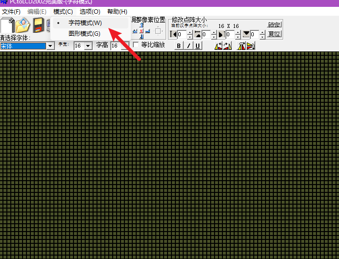


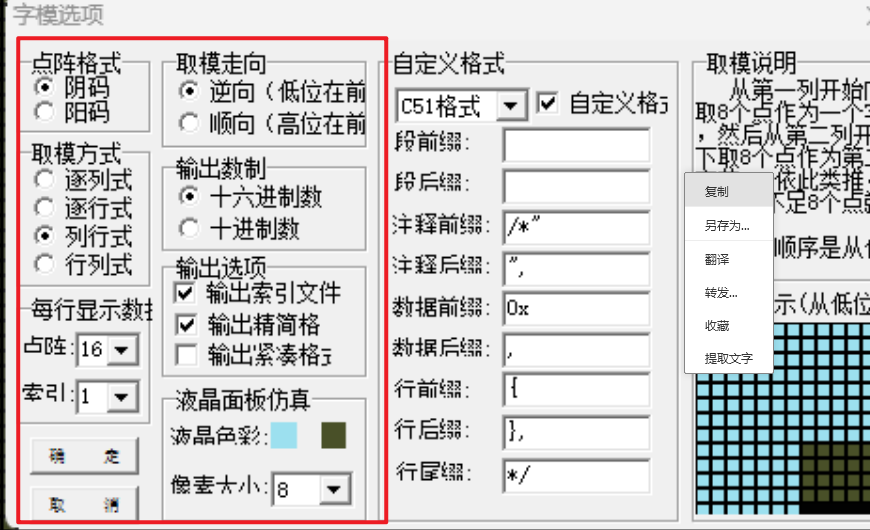

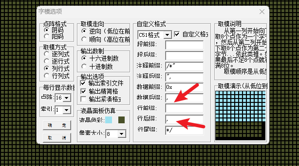


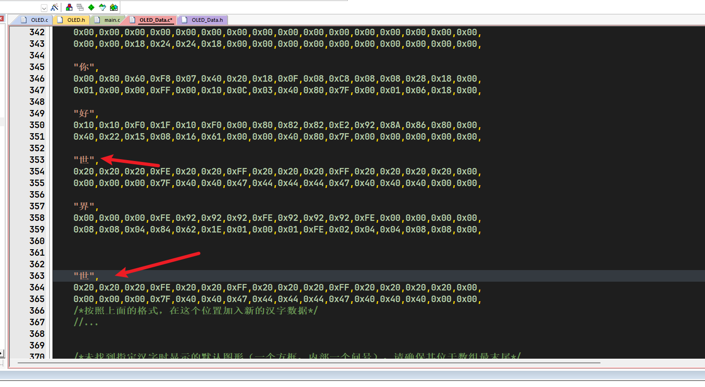

重复定义会以上面定义的字符为准


#### keil软件的配置

为了防止字体读不到才加上的

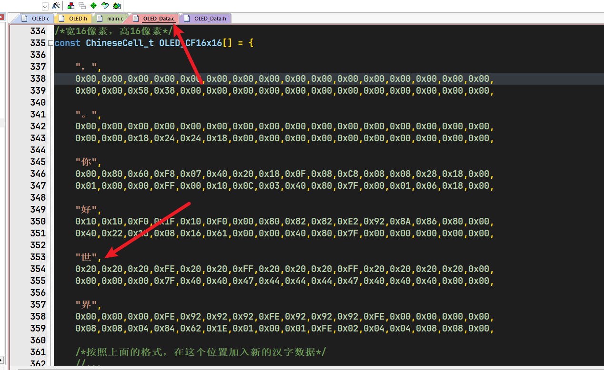


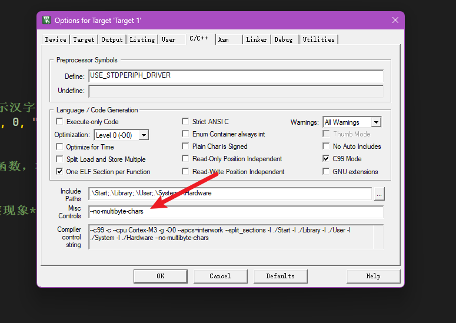

```
--no-multibyte-chars
```


```

#include "stm32f10x.h"                  // Device header
#include "Delay.h"
#include "OLED.h"

/**
  * 坐标轴定义：
  * 左上角为(0, 0)点
  * 横向向右为X轴，取值范围：0~127
  * 纵向向下为Y轴，取值范围：0~63
  * 
  *       0             X轴           127 
  *      .------------------------------->
  *    0 |
  *      |
  *      |
  *      |
  *  Y轴 |
  *      |
  *      |
  *      |
  *   63 |
  *      v
  * 
  */

int main(void)
{
	/*OLED初始化*/
	OLED_Init();

	/*在(0, 48)位置显示汉字串"你好，世界。"，字体大小为固定的16*16点阵*/
	OLED_ShowChinese(0, 0, "你好，世界。");
	
	
	/*调用OLED_Update函数，将OLED显存数组的内容更新到OLED硬件进行显示*/
	OLED_Update();
	
	/*延时3000ms，观察现象*/
	Delay_ms(3000);
	
	while (1)
	{
		
	}
}

```

## 图片取模


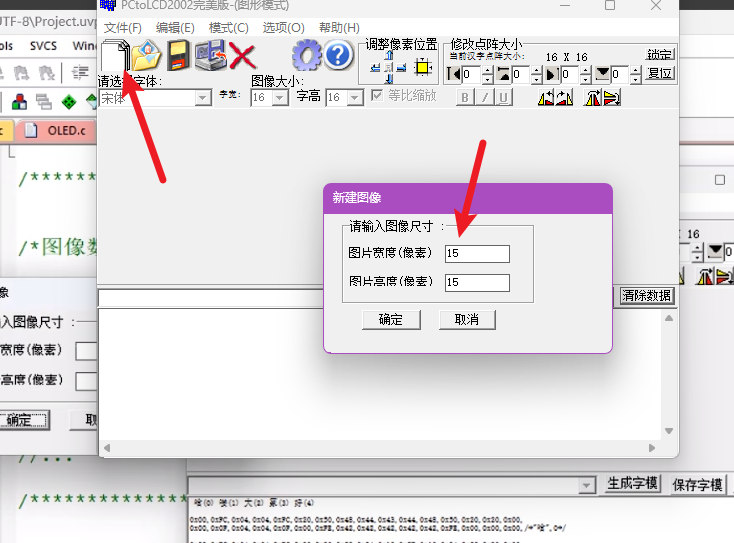


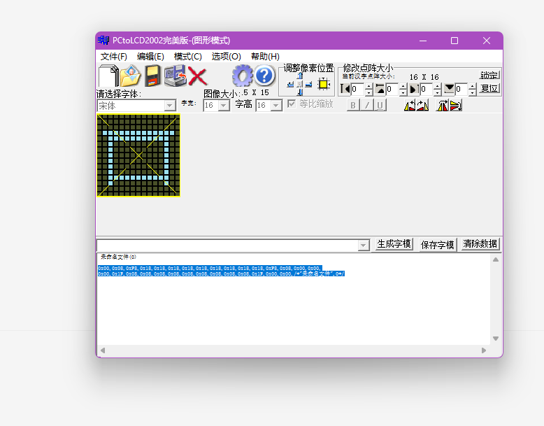


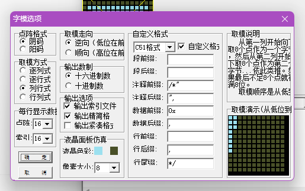

```c

#include "stm32f10x.h"                  // Device header
#include "Delay.h"
#include "OLED.h"

/**
  * 坐标轴定义：
  * 左上角为(0, 0)点
  * 横向向右为X轴，取值范围：0~127
  * 纵向向下为Y轴，取值范围：0~63
  * 
  *       0             X轴           127 
  *      .------------------------------->
  *    0 |
  *      |
  *      |
  *      |
  *  Y轴 |
  *      |
  *      |
  *      |
  *   63 |
  *      v
  * 
  */

int main(void)
{
	/*OLED初始化*/
	OLED_Init();

	/*在(0, 48)位置显示汉字串"你好，世界。"，字体大小为固定的16*16点阵*/
	//OLED_ShowChinese(0, 0, "你好，世界。");
	OLED_ShowImage(0,0,15,15,yizi);
	
	/*调用OLED_Update函数，将OLED显存数组的内容更新到OLED硬件进行显示*/
	OLED_Update();
	
	/*延时3000ms，观察现象*/
	Delay_ms(3000);
	
	while (1)
	{
		
	}
}


```

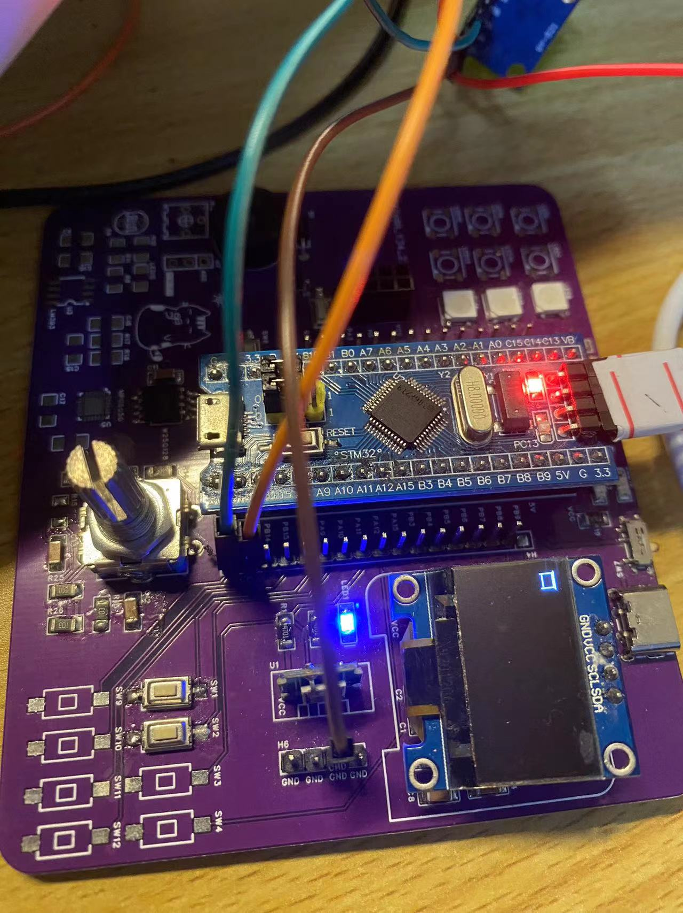


```c
#include "stm32f10x.h"                  // Device header
#include "Delay.h"
#include "OLED.h"

/**
  * 坐标轴定义：
  * 左上角为(0, 0)点
  * 横向向右为X轴，取值范围：0~127
  * 纵向向下为Y轴，取值范围：0~63
  * 
  *       0             X轴           127 
  *      .------------------------------->
  *    0 |
  *      |
  *      |
  *      |
  *  Y轴 |
  *      |
  *      |
  *      |
  *   63 |
  *      v
  * 
  */

int main(void)
{
	/*OLED初始化*/
	OLED_Init();

	/*在(0, 48)位置显示汉字串"你好，世界。"，字体大小为固定的16*16点阵*/
	//OLED_ShowChinese(0, 0, "你好，世界。");
	OLED_ShowImage(0,0,15,16,yizi);
	
	/*调用OLED_Update函数，将OLED显存数组的内容更新到OLED硬件进行显示*/
	OLED_Update();
	
	/*延时3000ms，观察现象*/
	Delay_ms(3000);
	
	while (1)
	{
		
	}
}

```

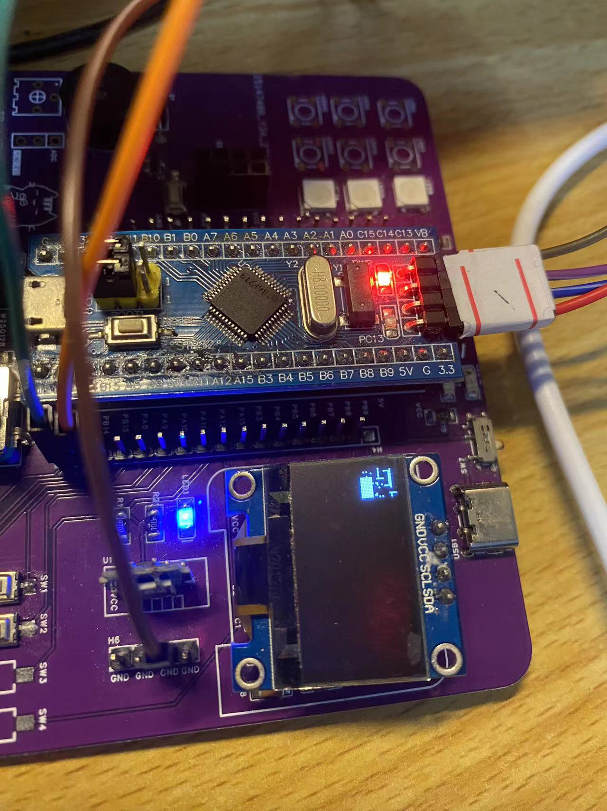


## 图书-Abobe ps-取模

https://www.bilibili.com/video/BV1EN41177Pc/?p=2&spm_id_from=pageDriver&vd_source=5e12cc40b4cf9bc1265b996e2d71fa81


## main.c

```
#include "stm32f10x.h"                  // Device header
#include "Delay.h"
#include "OLED.h"

/**
  * 坐标轴定义：
  * 左上角为(0, 0)点
  * 横向向右为X轴，取值范围：0~127
  * 纵向向下为Y轴，取值范围：0~63
  * 
  *       0             X轴           127 
  *      .------------------------------->
  *    0 |
  *      |
  *      |
  *      |
  *  Y轴 |
  *      |
  *      |
  *      |
  *   63 |
  *      v
  * 
  */

int main(void)
{
	/*OLED初始化*/
	OLED_Init();
	
	/*在(0, 0)位置显示字符'A'，字体大小为8*16点阵*/
	OLED_ShowChar(0, 0, 'A', OLED_8X16);
	
	/*在(16, 0)位置显示字符串"Hello World!"，字体大小为8*16点阵*/
	OLED_ShowString(16, 0, "Hello World!", OLED_8X16);
	
	/*在(0, 18)位置显示字符'A'，字体大小为6*8点阵*/
	OLED_ShowChar(0, 18, 'A', OLED_6X8);
	
	/*在(16, 18)位置显示字符串"Hello World!"，字体大小为6*8点阵*/
	OLED_ShowString(16, 18, "Hello World!", OLED_6X8);
	
	/*在(0, 28)位置显示数字12345，长度为5，字体大小为6*8点阵*/
	OLED_ShowNum(0, 28, 12345, 5, OLED_6X8);
	
	/*在(40, 28)位置显示有符号数字-66，长度为2，字体大小为6*8点阵*/
	OLED_ShowSignedNum(40, 28, -66, 2, OLED_6X8);
	
	/*在(70, 28)位置显示十六进制数字0xA5A5，长度为4，字体大小为6*8点阵*/
	OLED_ShowHexNum(70, 28, 0xA5A5, 4, OLED_6X8);
	
	/*在(0, 38)位置显示二进制数字0xA5，长度为8，字体大小为6*8点阵*/
	OLED_ShowBinNum(0, 38, 0xA5, 8, OLED_6X8);
	
	/*在(60, 38)位置显示浮点数字123.45，整数部分长度为3，小数部分长度为2，字体大小为6*8点阵*/
	OLED_ShowFloatNum(60, 38, 123.45, 3, 2, OLED_6X8);
	
	/*在(0, 48)位置显示汉字串"你好，世界。"，字体大小为固定的16*16点阵*/
	OLED_ShowChinese(0, 48, "你好，世界。");
	
	/*在(96, 48)位置显示图像，宽16像素，高16像素，图像数据为Diode数组*/
	OLED_ShowImage(96, 48, 16, 16, Diode);
	
	/*在(96, 18)位置打印格式化字符串，字体大小为6*8点阵，格式化字符串为"[%02d]"*/
	OLED_Printf(96, 18, OLED_6X8, "[%02d]", 6);
	
	/*调用OLED_Update函数，将OLED显存数组的内容更新到OLED硬件进行显示*/
	OLED_Update();
	
	/*延时3000ms，观察现象*/
	Delay_ms(3000);
	
	/*清空OLED显存数组*/
	OLED_Clear();
	
	/*在(5, 8)位置画点*/
	OLED_DrawPoint(5, 8);
	
	/*获取(5, 8)位置的点*/
	if (OLED_GetPoint(5, 8))
	{
		/*如果指定点点亮，则在(10, 4)位置显示字符串"YES"，字体大小为6*8点阵*/
		OLED_ShowString(10, 4, "YES", OLED_6X8);
	}
	else
	{
		/*如果指定点未点亮，则在(10, 4)位置显示字符串"NO "，字体大小为6*8点阵*/
		OLED_ShowString(10, 4, "NO ", OLED_6X8);
	}
	
	/*在(40, 0)和(127, 15)位置之间画直线*/
	OLED_DrawLine(40, 0, 127, 15);
	
	/*在(40, 15)和(127, 0)位置之间画直线*/
	OLED_DrawLine(40, 15, 127, 0);
	
	/*在(0, 20)位置画矩形，宽12像素，高15像素，未填充*/
	OLED_DrawRectangle(0, 20, 12, 15, OLED_UNFILLED);
	
	/*在(0, 40)位置画矩形，宽12像素，高15像素，填充*/
	OLED_DrawRectangle(0, 40, 12, 15, OLED_FILLED);
	
	/*在(20, 20)、(40, 25)和(30, 35)位置之间画三角形，未填充*/
	OLED_DrawTriangle(20, 20, 40, 25, 30, 35, OLED_UNFILLED);
	
	/*在(20, 40)、(40, 45)和(30, 55)位置之间画三角形，填充*/
	OLED_DrawTriangle(20, 40, 40, 45, 30, 55, OLED_FILLED);
	
	/*在(55, 27)位置画圆，半径8像素，未填充*/
	OLED_DrawCircle(55, 27, 8, OLED_UNFILLED);
	
	/*在(55, 47)位置画圆，半径8像素，填充*/
	OLED_DrawCircle(55, 47, 8, OLED_FILLED);
	
	/*在(82, 27)位置画椭圆，横向半轴12像素，纵向半轴8像素，未填充*/
	OLED_DrawEllipse(82, 27, 12, 8, OLED_UNFILLED);
	
	/*在(82, 47)位置画椭圆，横向半轴12像素，纵向半轴8像素，填充*/
	OLED_DrawEllipse(82, 47, 12, 8, OLED_FILLED);
	
	/*在(110, 18)位置画圆弧，半径15像素，起始角度25度，终止角度125度，未填充*/
	OLED_DrawArc(110, 18, 15, 25, 125, OLED_UNFILLED);
	
	/*在(110, 38)位置画圆弧，半径15像素，起始角度25度，终止角度125度，填充*/
	OLED_DrawArc(110, 38, 15, 25, 125, OLED_FILLED);
	
	/*调用OLED_Update函数，将OLED显存数组的内容更新到OLED硬件进行显示*/
	OLED_Update();
	
	/*延时3000ms，观察现象*/
	Delay_ms(3000);
	
	while (1)
	{
		for (uint8_t i = 0; i < 4; i ++)
		{
			/*将OLED显存数组部分数据取反，从(0, i * 16)位置开始，宽128像素，高16像素*/
			OLED_ReverseArea(0, i * 16, 128, 16);
			
			/*调用OLED_Update函数，将OLED显存数组的内容更新到OLED硬件进行显示*/
			OLED_Update();
			
			/*延时1000ms，观察现象*/
			Delay_ms(1000);
			
			/*把取反的内容翻转回来*/
			OLED_ReverseArea(0, i * 16, 128, 16);
		}
		
		/*将OLED显存数组全部数据取反*/
		OLED_Reverse();
		
		/*调用OLED_Update函数，将OLED显存数组的内容更新到OLED硬件进行显示*/
		OLED_Update();
		
		/*延时1000ms，观察现象*/
		Delay_ms(1000);
	}
}

```


