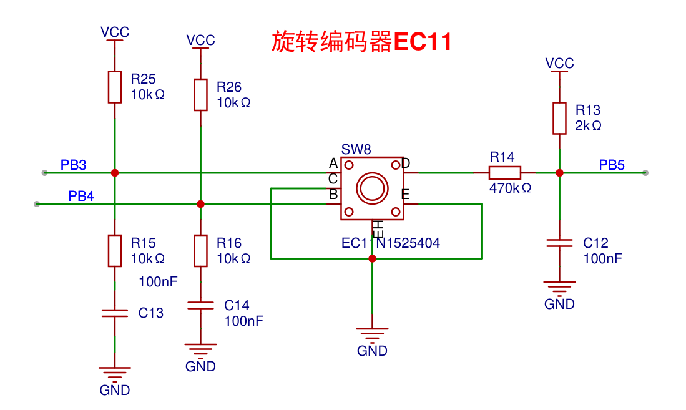

## 旋转编码器EC11



### 参考资料


按下没问题


## 代码

#### 直接轮询


[优雅的对旋转编码器消抖（EC11,正交) - 知乎 (zhihu.com)](https://zhuanlan.zhihu.com/p/453130384)

```c
#define Aio PA3
#define Bio PA4
int flag = 0;  //标志位
boolean CW_1 = 0;
boolean CW_2 = 0;
void Aio_inter() {
  // 只要处理一个脚的外部中断--上升沿&下降沿
  int alv = digitalRead(Aio);
  int blv = digitalRead(Bio);
  if (flag == 0 && alv == LOW) {
    CW_1 = blv;
    flag = 1;
  }
  if (flag && alv) {
    CW_2 = !blv;  //取反是因为 alv,blv必然异步，一高一低。
    if (CW_1 && CW_2) {
      dir++;
    }
    if (CW_1 == false && CW_2 == false) {
      dir--;
    }
    flag = 0;
  }
}
void setup(){
  Serial.begin(115200);
  pinMode(Aio, INPUT);
  pinMode(Bio, INPUT);
//只要消耗一个外部中断资源
  attachInterrupt(Aio, Aio_inter, CHANGE);
}
//变量dir在中断里处理，loop中随时调用
void loop(){
  Serial.printf("dir : %d",dir);
  delay(1000); 
}
// 觉得满意麻烦点个赞呗
```


```c
#include "stm32f10x.h"                  // Device header
#include "Delay.h"
#include "LED.h"
#include "Key.h"
#include "OLED.h"
#include "EC11.h"
#include <stdbool.h>
uint8_t KeyNum;		//定义用于接收按键键码的变量
int flag = 0;  //标志位
bool CW_1 = 0;
bool CW_2 = 0;
int dir =0;
int keynum =0;
int main(void)
{
	/*模块初始化*/
	LED_Init();		//LED初始化
	Key_Init();		//按键初始化
	LED1_ON();			
    OLED_Init();

    OLED_ShowString(1, 1, "---HelloWorld---");	
    OLED_ShowString(2, 1, "dir:");	
    OLED_ShowNum(2,5,dir,2);
    OLED_ShowString(3, 1, "keynum:");	
    OLED_ShowNum(3,8,keynum,2);
    
    int alv = GPIO_ReadInputDataBit(GPIOB, GPIO_Pin_3);
    int blv = GPIO_ReadInputDataBit(GPIOB, GPIO_Pin_4);
    while (1) 
    {    
        KeyNum = Key_GetNum();		//获取按键键码
		if (KeyNum == 1)			//按键1按下
		{
			LED1_Turn();			//LED1翻转
            keynum++;
            OLED_ShowNum(3,8,keynum,2);
		}
       
          if (flag == 0 && alv == 0) {
                CW_1 = blv;
                flag = 1;
                //OLED_ShowString(4, 1, "CW_1 = blv");	
              }
              if (flag && alv) {
                CW_2 = !blv;  //取反是因为 alv,blv必然异步，一高一低。
                if (CW_1 && CW_2) {
                    dir++;
                    OLED_ShowNum(2,1,dir,2);
                }
                if (CW_1 == false && CW_2 == false) {
                    dir--;
                    OLED_ShowNum(2,1,dir,2);
                }
                flag = 0;
          }
        
        
    }
 
}
        
        
        
     


```

代码有问题


```
#include "stm32f10x.h"       
#include <stdbool.h>
#include "Delay.h"
#include "LED.h"
#include "Key.h"
#include "OLED.h"
#include "EC11.h"

uint8_t KeyNum;		//定义用于接收按键键码的变量

int Encoder_Count  =0;
int keynum =0;
int main(void)
{
	LED_Init();		//LED初始化
	Key_Init();		//按键初始化
	LED1_ON();			
    OLED_Init();

    OLED_ShowString(1, 1, "---HelloWorld---");	
    OLED_ShowString(2, 1, "Count:");	
    OLED_ShowNum(2,7,Encoder_Count ,2);
    OLED_ShowString(3, 1, "keynum:");	
    OLED_ShowNum(3,8,keynum,2);
    
    int alv = GPIO_ReadInputDataBit(GPIOB, GPIO_Pin_3);
    int blv = GPIO_ReadInputDataBit(GPIOB, GPIO_Pin_4);
    while (1) 
    {    
        KeyNum = Key_GetNum();		//获取按键键码
		if (KeyNum == 1)			//按键1按下
		{
			LED1_Turn();			//LED1翻转
            keynum++;
            OLED_ShowNum(3,8,keynum,2);
		}
       
           if (GPIO_ReadInputDataBit(GPIOB, GPIO_Pin_3) == 0)
           {
                Delay_ms(20);
                if (GPIO_ReadInputDataBit(GPIOB, GPIO_Pin_4) == 0)
                {   
                    Delay_ms(20);
                    Encoder_Count ++;
                    OLED_ShowNum(2,7,Encoder_Count ,2);
                    OLED_ShowString(4, 1, "++");	
                }
           }
#if 1

           if (GPIO_ReadInputDataBit(GPIOB, GPIO_Pin_4) == 0)
            {
                Delay_ms(20);
                if (GPIO_ReadInputDataBit(GPIOB, GPIO_Pin_3) == 0)
                {
                    Delay_ms(20);
                    Encoder_Count --;
                    OLED_ShowNum(2,7,Encoder_Count ,2);
                    OLED_ShowString(4, 1, "--");	
                }
            }


#endif           
           

        
        
    }
 
}
        
        
        
     


```

乱码，无法判断左边和右边


[stm32旋转编码器丝滑驱动_stm32驱动编码器-CSDN博客](https://blog.csdn.net/weixin_44777220/article/details/134138998?spm=1001.2101.3001.6650.2&utm_medium=distribute.pc_relevant.none-task-blog-2~default~CTRLIST~Rate-2-134138998-blog-129387499.235^v43^pc_blog_bottom_relevance_base8&depth_1-utm_source=distribute.pc_relevant.none-task-blog-2~default~CTRLIST~Rate-2-134138998-blog-129387499.235^v43^pc_blog_bottom_relevance_base8&utm_relevant_index=5)


```


```


#### 中断读取

