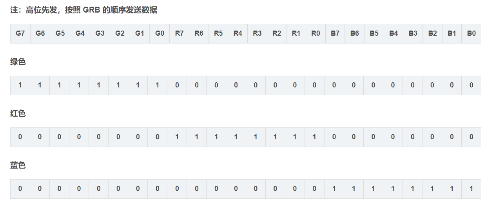

### 视频


<iframe src="//live.csdn.net/v/363100" scrolling="no" border="0" frameborder="no" framespacing="0" allowfullscreen="true" height="800" weight="400"> </iframe>


### WS2812B





[WS2812B全彩LED驱动-CSDN博客](https://blog.csdn.net/Lennon8_8/article/details/108980808)


## 代码


### main.c

```c

#include "stm32f10x.h"                  // Device header
#include "Delay.h"
#include "OLED.h"
#include "WS2812B.h"
int main(void)
{
	/*模块初始化*/
	OLED_Init();		//OLED初始化
	
	/*OLED显示*/
	OLED_ShowChar(1, 1, 'A');				//1行1列显示字符A
	
	OLED_ShowString(1, 3, "HelloWorld!");	//1行3列显示字符串HelloWorld!
	
	Color_TypeDef temp;
	
	WS2812B_Init();	
    WS2812B_Test();
    temp.R = 0xff;
	temp.G = 0x00;
	temp.B = 0x00; //0xff
	WS2812B_FillColor(10,20,&temp);
	while(1)
	{
		Delay_ms(50); 
        if(temp.R == 0xff){
            OLED_ShowString(2, 3, "RED!");	
        }else if(temp.G == 0xff){
            OLED_ShowString(2, 3, "Green!");	
        }else if(temp.B == 0xff){
            OLED_ShowString(2, 3, "Blue!");	
        }
        
        
			
        WS2812B_MovePixel(2);
        WS2812B_RefreshPixel();
		
	}	


}


```


### WS2812B.h


```
/************************************************************
Copyright (C), 2013-2020, XINZHIYIKONG.Co.,Ltd.
@FileName: WS2812B.h
@Author  : 糊读虫 QQ:570525287
@Version : 1.0
@Date    : 2020-12-25
@Description: WS2812B全彩LED灯驱动
@Function List:
@History    : 
<author> <time> <version > <desc>

***********************************************************/

#ifndef __WS2812B_H
#define	__WS2812B_H

#include "stm32f10x.h"     

//WS2812B IO 定义  注意初始化APB时钟也要修改
#define WS2812B_PORT		GPIOC
#define WS2812B_PIN			GPIO_Pin_15
#define WS2812B_RCC_AHB		RCC_APB2Periph_GPIOC  //RCC时钟

#define WS2812B_Hi()		WS2812B_PORT->BSRR=WS2812B_PIN	//GPIO_ResetBits(LED1_PORT, LED1_PIN)
#define WS2812B_Low()		WS2812B_PORT->BRR=WS2812B_PIN	//GPIO_SetBits(LED1_PORT, LED1_PIN)

//颜色
typedef struct color{
	u8 G;
	u8 R;
	u8 B;
}Color_TypeDef;

//------------------------
#define PIXEL_NUM	59	//LED灯的个数

void WS2812B_Init(void);
void WS2812B_Reset(void);
void WS2812B_WriteColor(Color_TypeDef *pColor);
void WS2812B_RefreshPixel(void);

void WS2812B_FillColor(u16 start,u16 end,Color_TypeDef *pColor);
void WS2812B_MovePixel(u8 dir);

void WS2812B_Test(void);
#endif /* __WS2812B_H */


    

```


### WS2812B.c

```


#include "WS2812B.h"

Color_TypeDef PixelBuf[PIXEL_NUM]; //像数数据
uint8_t flag;

//晶振48M,每个nop是20.83ns
#define DELAY_20_8nS		__nop()		//1个nop是20.8ns
#define DELAY_104nS			DELAY_20_8nS;DELAY_20_8nS;DELAY_20_8nS;DELAY_20_8nS;DELAY_20_8nS //5个nop是104ns
#define Delay_320nS()		DELAY_104nS;DELAY_104nS;DELAY_104nS  //30个nop
 
/*---------------------------------------------------------------------------
@Function   :Delay_850nS
@Description:检测开关初始化
@Input      :无
@Retrun     :无
@Others     :T1H T0L 时间在  580ns~1.6us,取850ns   实测855us
----------------------------------------------------------------------------*/
void Delay_850nS(void)
{
	//进入函数所用的时间约为310ns
	DELAY_104nS;
	DELAY_104nS;
	Delay_320nS();
	DELAY_20_8nS;
}
/*---------------------------------------------------------------------------
@Function   :Delay_300uS
@Description:
@Input      :无
@Retrun     :无
@Others     :
----------------------------------------------------------------------------*/
void Delay_300uS(void)
{
	uint8_t i;
	while(i--)
	{
		Delay_320nS();
	}
}

/*---------------------------------------------------------------------------
@Function   :WS2812B_Init
@Description:初始化
@Input      :无
@Retrun     :无
@Others     :
----------------------------------------------------------------------------*/
void WS2812B_Init(void)
    
{
	GPIO_InitTypeDef GPIO_InitStructure;
    
    RCC_APB2PeriphClockCmd(WS2812B_RCC_AHB, ENABLE);		//开启GPIOA的时钟
    
    

	GPIO_InitStructure.GPIO_Pin = WS2812B_PIN ;
	GPIO_InitStructure.GPIO_Mode = GPIO_Mode_Out_PP;
	GPIO_InitStructure.GPIO_Speed =GPIO_Speed_50MHz;
	GPIO_Init(WS2812B_PORT, &GPIO_InitStructure);

    
    
   
    
	GPIO_SetBits(WS2812B_PORT, WS2812B_PIN);
}

/*---------------------------------------------------------------------------
@Function   :WS2812B_Reset
@Description:复位
@Input      :无
@Retrun     :无
@Others     :
----------------------------------------------------------------------------*/
void WS2812B_Reset(void)          //复位函数
{
	WS2812B_Low();
	Delay_300uS();
}

/*---------------------------------------------------------------------------
@Function   :WS2812B_WriteByte
@Description:写一个字节
@Input      :无
@Retrun     :无
@Others     :
----------------------------------------------------------------------------*/
void WS2812B_WriteByte(uint8_t dat)
{
	u8 i;
	for (i=0;i<8;i++)
	{
		//先发送高位
		if (dat & 0x80) //1
		{
			WS2812B_Hi();
			Delay_850nS(); //T1H
			WS2812B_Low();	
			Delay_320nS(); //T1L
		}
		else	//0
		{
			WS2812B_Hi();
			Delay_320nS(); //T0H
			WS2812B_Low();	
			Delay_850nS(); //T0L
		}
		dat<<=1;
	}
}


/*---------------------------------------------------------------------------
@Function   :WS2812B_WriteColor
@Description:写入1个24bit颜色数据
@Input      :无
@Retrun     :无
@Others     :
----------------------------------------------------------------------------*/
void WS2812B_WriteColor(Color_TypeDef *pColor)
{
	WS2812B_WriteByte(pColor->G);
	WS2812B_WriteByte(pColor->R);
	WS2812B_WriteByte(pColor->B);
}

/*---------------------------------------------------------------------------
@Function   :WS2812B_RefreshPixel
@Description:更新显示
@Input      :无
@Retrun     :无
@Others     :
----------------------------------------------------------------------------*/
void WS2812B_RefreshPixel(void)
{
	u8 i;

	for(i=0;i<PIXEL_NUM;i++)
	{
		WS2812B_WriteColor(&PixelBuf[i]);
	}
}

//----------------------------------------
void WS2812B_Test(void)
{
	u8 i;
	Color_TypeDef temp;
	
    temp.R = 0x00; //0xFF
    temp.G = 0xFF;//0x00
    temp.B = 0xFF;
	for(i=0;i<60;i++)
	{
		WS2812B_WriteColor(&temp);
	}
}

//测试延时时间
void WS2812B_Test2(void)
{
	WS2812B_Hi();
	Delay_850nS();
	WS2812B_Low();
}

//============================================================================
void Copy_Color(Color_TypeDef *pDst,Color_TypeDef *pScr)
{
	pDst->R = pScr->R;
	pDst->G = pScr->G;
	pDst->B = pScr->B;
}

/*---------------------------------------------------------------------------
@Function   :WS2812B_FillColor
@Description:填充颜色
@Input      :start：开始位置;end:结束信置;pColor:颜色值
@Retrun     :无
@Others     :
----------------------------------------------------------------------------*/
void WS2812B_FillColor(u16 start,u16 end,Color_TypeDef *pColor)
{
	if (start > end) //交换位置
	{
		u16 temp;
		temp = start;
		start = end;
		end = temp;
	}

	if (start >= PIXEL_NUM)return; //超出范围
	if (end >= PIXEL_NUM)end = PIXEL_NUM-1;

	//填充颜色值
	while(start <= end)
	{
		Copy_Color(&PixelBuf[start],pColor);
		start++;
	}
}

/*---------------------------------------------------------------------------
@Function   :WS2812B_MovePixel
@Description:循环移动像素颜色
@Input      :dir:方向;
@Retrun     :无
@Others     :
----------------------------------------------------------------------------*/
void WS2812B_MovePixel(u8 dir)
{
	Color_TypeDef temp;
	u8 i;

	if (dir) //向左移动
	{
		Copy_Color(&temp,&PixelBuf[PIXEL_NUM-1]);

		i = PIXEL_NUM-1;
		while(i)
		{
			 Copy_Color(&PixelBuf[i],&PixelBuf[i-1]);
			 i--;
		}
		Copy_Color(&PixelBuf[0],&temp);
	}
	else  //向右移动
	{
		Copy_Color(&temp,&PixelBuf[0]);

		i = 0;
		while(i < (PIXEL_NUM-1))
		{
			Copy_Color(&PixelBuf[i],&PixelBuf[i+1]);
			i++;
		}
		Copy_Color(&PixelBuf[PIXEL_NUM-1],&temp);
	}
}

//----------------------------------END OF FILE------------------------------


```

