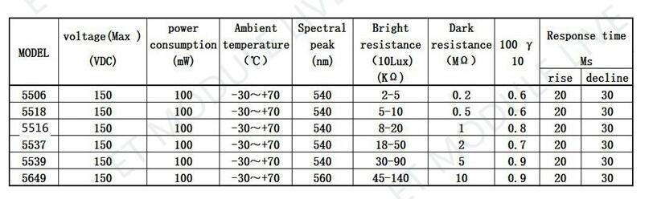

### 视频

----

光敏电阻型号**5516**

**产品特性：**

光敏电阻模块一般用来检测周围环境的光线的亮度，触发单片机或继电器模块等。使用宽电压LM393比较器，信号干净，波形好，驱动能力强，超过15mA。配可调电位器可调节检测光线亮度。设有固定螺栓孔M3，方便安装。

**工作原理：**

光敏电阻是用硫化隔或硒化隔等半导体材料制成的特殊电阻器，其工作原理是基于内光电效应。随着光照强度的升高，电阻值迅速降低，由于光照产生的载流子都参与导电，在外加电场的作用下作漂移运动，电子奔向电源的正极，空穴奔向电源的负极，从而使光敏电阻器的阻值迅速下降。其在无光照时，几乎呈高阻状态，暗电阻很大

**产品参数：**

工作电压：DC3.3-5V

光敏电阻型号：5516

**使用说明：**

数字量DO输出端可以直接驱动本店继电器模块，由此可以组成一个光控开关。模拟量AO可以和AD模块相连，通过AD转换，可以获得环境光强的数值。当环境光线亮度达不到设定阈值时，DO端输出高电平，当外界环境光线亮度超过设定阈值时，DO端输出低电平。检测亮度可以通过电位器进行调节，顺时针调电位器，检测亮度增加；逆时针调电位器，检测亮度减少。

