是我用图形库配置，比较方便

 

首先先下载STM32标准库的压缩包

 

https://www.st.com/en/microcontrollers-microprocessors.html

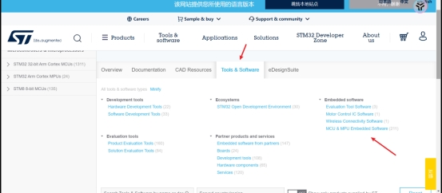 

 

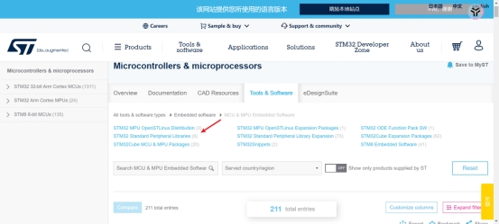 

 

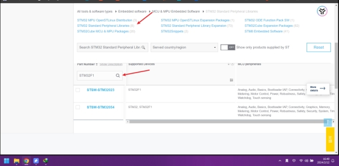 

 

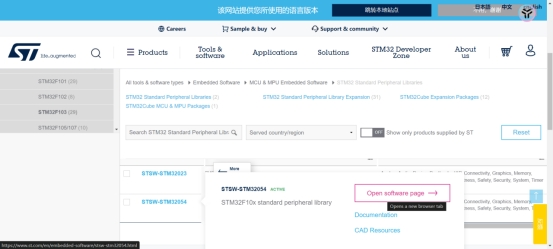 

https://www.st.com/zh/embedded-software/stsw-stm32054.html

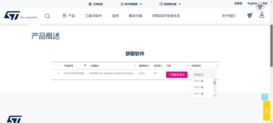 

 

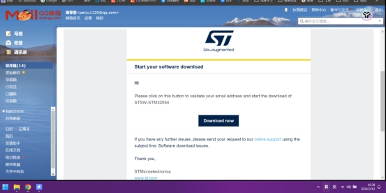 

 

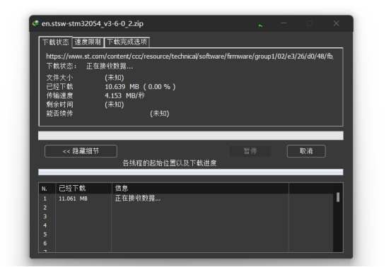 

参考链接

[https://blog.csdn.net/athen21/article/details/83585087#:~:text=%E6%89%93%E5%BC%80%E9%93%BE%E6%8E%A5%EF%BC%9A%20https%3A%2F%2Fwww.keil.com%2Fdd2%2FPack%2F%202.%20%E4%B8%8B%E6%8B%89%E6%89%BE%E5%88%B0%E6%89%80%E4%BD%BF%E7%94%A8%E7%9A%84STM32%E8%8A%AF%E7%89%87%E7%9A%84%E5%9E%8B%E5%8F%B7%EF%BC%8C%E7%82%B9%E5%87%BB%E5%8F%B3%E4%BE%A7%E4%B8%8B%E8%BD%BD%E7%AE%AD%E5%A4%B4%E5%8F%AF%E7%9B%B4%E6%8E%A5%E8%BF%9B%E8%A1%8C%E4%B8%8B%E8%BD%BD%E3%80%82%203.%20%E4%B8%8B%E8%BD%BD%E5%AE%8C%E6%88%90%E5%90%8E%EF%BC%8C%E6%89%BE%E5%88%B0%E6%89%80%E4%B8%8B%E8%BD%BD%E6%96%87%E4%BB%B6%E7%9B%B4%E6%8E%A5%E7%82%B9%E5%87%BB%EF%BC%8C%E4%BC%9A%E8%87%AA%E5%8A%A8%E5%AE%89%E8%A3%85%E5%88%B0%E5%AF%B9%E5%BA%94%E7%9A%84%E7%9B%AE%E5%BD%95%E4%B8%8B%E3%80%82%20STM32%E5%87%BD%E6%95%B0%E5%BA%93%E6%98%AFST%E5%AE%98%E6%96%B9%E7%BB%99%E5%87%BA%E7%9A%84%E6%A0%87%E5%87%86%E5%87%BD%E6%95%B0%E5%BA%93%EF%BC%8C%E4%B8%8B%E8%BD%BD%E6%96%B9%E6%B3%95%E5%A6%82%E4%B8%8B%EF%BC%9A,1.%20%E6%89%93%E5%BC%80%E9%93%BE%E6%8E%A5%EF%BC%9A%20https%3A%2F%2Fwww.st.com%2Fen%2Fmicrocontrollers.html%20%EF%BC%8C%E7%82%B9%E5%87%BBTool%20%26%20Software%20%E6%8C%89%E9%92%AE%E3%80%82](https://blog.csdn.net/athen21/article/details/83585087#:~:text=打开链接： https%3A%2F%2Fwww.keil.com%2Fdd2%2FPack%2F 2. 下拉找到所使用的STM32芯片的型号，点击右侧下载箭头可直接进行下载。 3. 下载完成后，找到所下载文件直接点击，会自动安装到对应的目录下。 STM32函数库是ST官方给出的标准函数库，下载方法如下：,1. 打开链接： https%3A%2F%2Fwww.st.com%2Fen%2Fmicrocontrollers.html ，点击Tool %26 Software 按钮。)

下载完成后

 

 

 

 

**新建文件夹，开始配置工程**

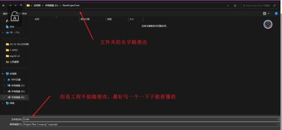 

选择你需要编程的芯片

 

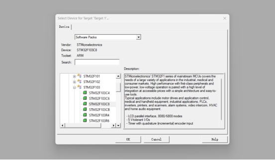 

这个需要自动下载，很慢取消掉自己配一下

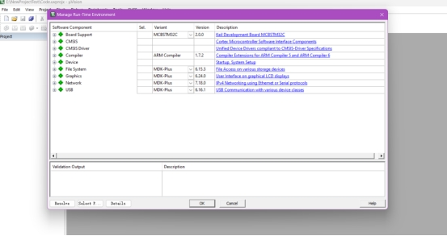 

 

 

 

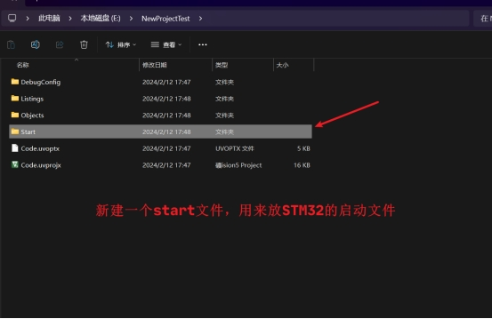 

 

这些文件有什么区别

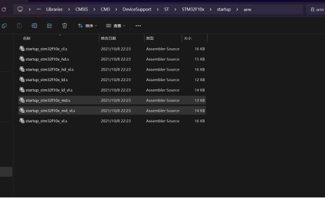 

 

stm32f10x.h这些文件类似51的头文件<REG52.H>，放的是寄存器的地址

 

system 芯片的时钟在这里配置，STM3F103C8T6的频率在这里配置。最高频率是72MHz

 

 

放的是，内核和外核的一些配置文件

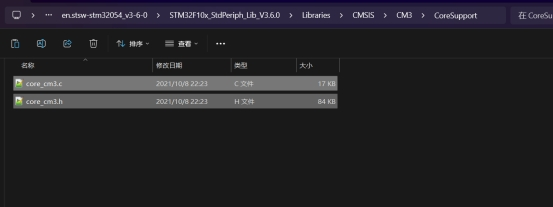 

 

在keil里面同样去建一个文件

 

 

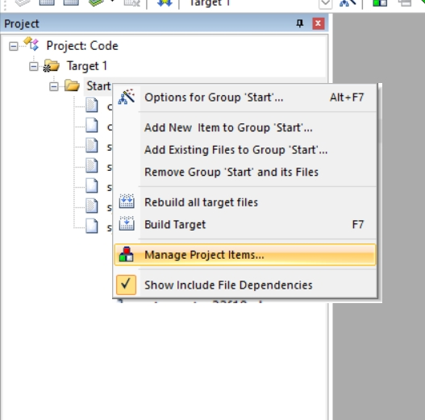 

 

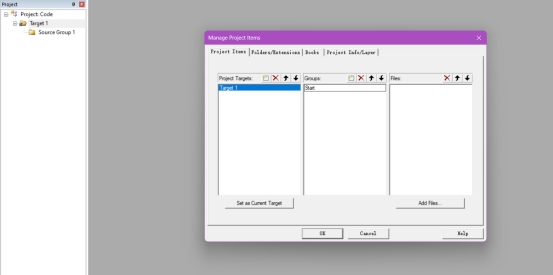 

 

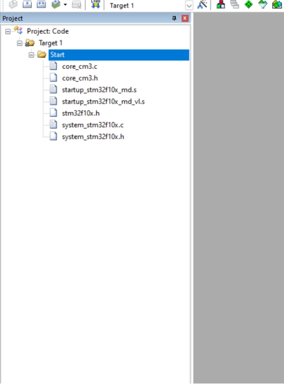 

还需要把Start的这个文件的路径加入进来

 

 

新建一个User文件夹，也是一样，三步：

文件里再建一个文件夹

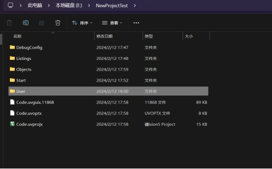 

工程里再建一个

把文件夹填加到工程里面

 

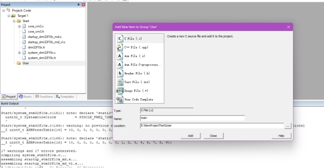 

 

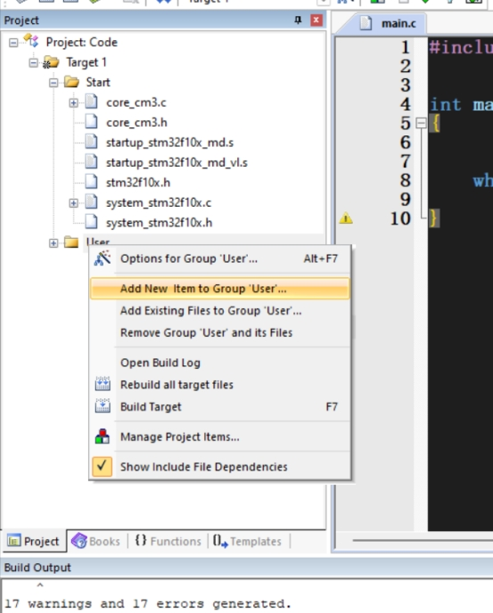 

 

 

**编译报错**

https://blog.csdn.net/weixin_43716668/article/details/129030613

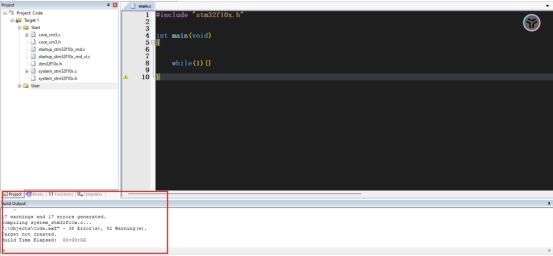 

 

 

 

**编译报错**

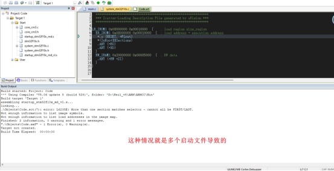 

去掉一个启动文件就好了

https://blog.csdn.net/qq_36347513/article/details/123919187

 

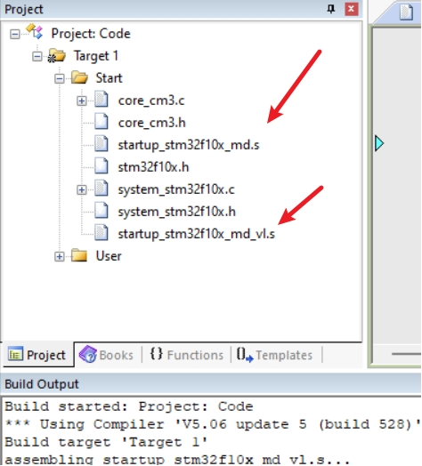 

 

 

 

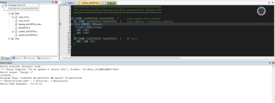 

 

 

**编译成功**

 

 

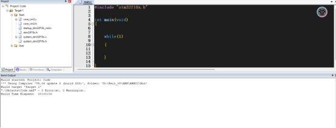 

 

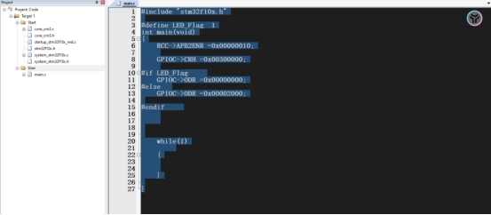 

 

 

\#include "stm32f10x.h"

 

\#define LED_Flag  1

int main(void)

{

  RCC->APB2ENR =0x00000010;

  

  GPIOC->CRH =0x00300000;

  

\#if LED_Flag   

  GPIOC->ODR =0x00000000;

\#else  

  GPIOC->ODR =0x00002000;

 

\#endif   

  

  

 

 

  while(1)

​    

  {

  

  

  }

 

}

 

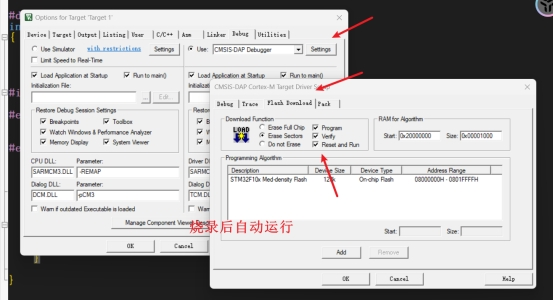 

 

 

**库函数**

同样需要新建文件夹，三步，然后配置进去，寄存器里面

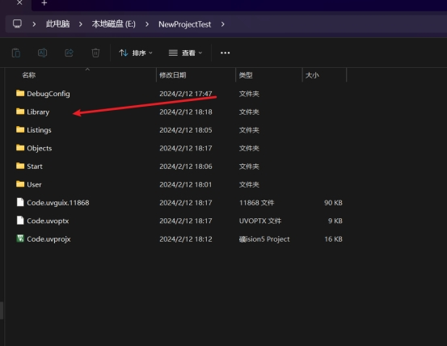 

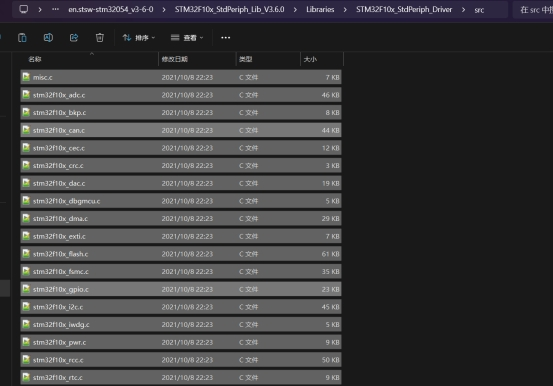 

 

把库函数配置进去，还需要配置库函数和头文件，包含文件，才能使用库函数是

 

 

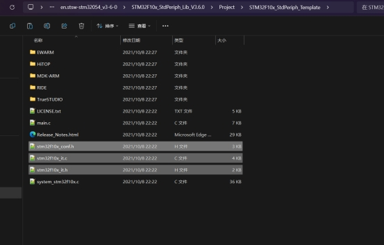 

 

 

 

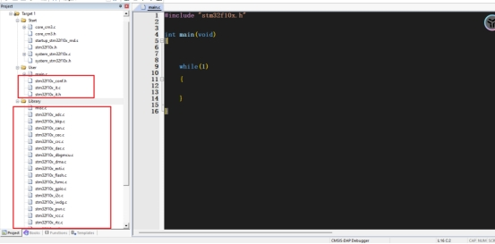 

 

 

要配置宏定义给配置才能去使用

 

 

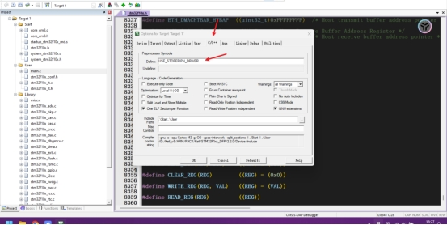 

**库函数编译成功**

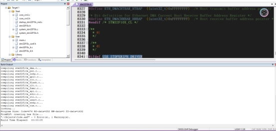 

 

```C
\#include "stm32f10x.h"

 

 

int main(void)

{

  

 

/*开启时钟*/

RCC_APB2PeriphClockCmd(RCC_APB2Periph_GPIOC, ENABLE);//开启GPIOA的时钟

//使用各个外设前必须开启时钟，否则对外设的操作无效

 

/*GPIO初始化*/

GPIO_InitTypeDef GPIO_InitStructure;//定义结构体变量

 

GPIO_InitStructure.GPIO_Mode = GPIO_Mode_Out_PP;//GPIO模式，赋值为推挽输出模式

GPIO_InitStructure.GPIO_Pin = GPIO_Pin_13;//GPIO引脚，赋值为第0号引脚

GPIO_InitStructure.GPIO_Speed = GPIO_Speed_50MHz;//GPIO速度，赋值为50MHz

 

GPIO_Init(GPIOC, &GPIO_InitStructure);//将赋值后的构体变量传递给GPIO_Init函数

//函数内部会自动根据结构体的参数配置相应寄存器

//实现GPIOA的初始化

 

/*主循环，循环体内的代码会一直循环执行*/

while (1)

{

 

\#if 0

  GPIO_ResetBits(GPIOC, GPIO_Pin_13);

​    

\#else  

 

   GPIO_SetBits(GPIOC, GPIO_Pin_13);  

\#endif

 

  }

}

 
```

