[[6-3\] TIM输出比较_哔哩哔哩_bilibili](https://www.bilibili.com/video/BV1th411z7sn/?p=15&vd_source=5e12cc40b4cf9bc1265b996e2d71fa81)

定时器来产生PWN波形

又因为PWN是驱动电机的必要条件

**OC (Output Compare)输出比较**

 

 

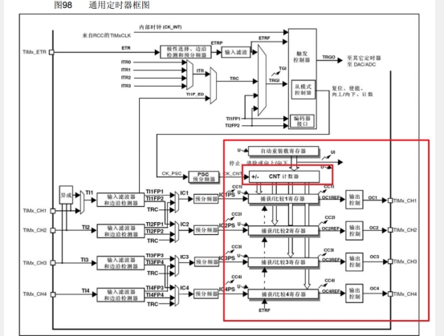 

 

 

一般表示的是输入捕获和输出比较的单元，这个捕获/比较寄存器是输入捕获和输出比较共用的，那在输出比较这里，这块电路会比较CNT和CCR的值，

刚才我们说了CC就是捕获/比较的意思，R是Register，寄存器的意思，这个捕获/比较寄存器是输入捕获和输出比较共用的，当使用输出比较时，它就是比较寄存器，那在输出比较这里，这块电路会比较CNT和CCR的值，CNT计数自增，CCR是我们给定的一个值，**当CNT大于CCR、小于CCR或者等于CCR时。CNT计数自增，CCR是我们给定的一个值，当CNT大于CCR、小于CCR或者等于CCR时。这样就可以输出一个电平不断跳变的PWN波形了，这就是输出比较的基本功能，**OC1,OC2,OC3,OC4.这个三个刚好可以去三相无刷电机去使用，现在主要是定时器的输出比较功能。

输出比较可以通过比较CNT与CCR寄存器值的关系，来对输出电平进行置1、置0或翻转的操作，用于输出一定频率和占空比的PWM波形

 

 

 

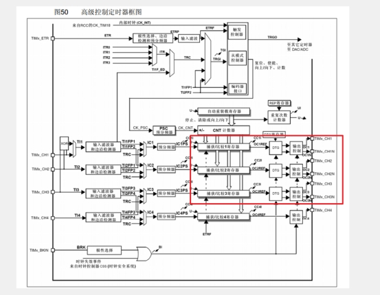 

OC1,OC2,OC3,OC4里面OC1,OC2,OC3这个三个刚好可以去三相无刷电机去使用

**每个高级定时器和通用定时器都拥有4个输出比较通道**

**高级定时器的前3个通道额外拥有死区生成和互补输出的功能**

 

**PWM** 

PWM (Pulse Width Modulation）脉冲宽度调制

在具有惯性的系统中,可以通过对一系列脉冲的宽度进行调制,来等效地获得所需要的模拟参量,常应用于电机控速等领域

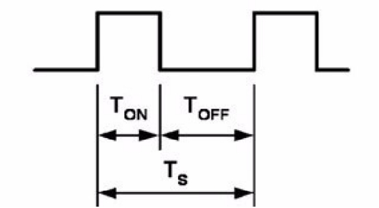 

 

**PWM参数**

频率 = 1/Ts

占空比 = ToN/Ts

分辨率 = 占空比变化步距

**PWN的原理就是极小的范围内，实现高低电平的翻转。**当然，PWM的应用场景必须要是一个惯性系统，就是说LED在熄灭的时候，由于余晖和人眼视觉暂留现象，LED不会立马熄灭，而是有一定的惯性，过一小段时间才会熄灭，电机也是，当电机断电时，电机的转动不会立马停止。而是有一定的惯性，过一会才停，**PWN的电平跳变的高低电平是可以等效成中间虚线的模拟量**，周期的倒数就是频率。PWM的频率越快，那它等效模拟的信号就越平稳，一般来说PWM的频率都在几K到几十KHz，这个频率就已经足够快了。高电平是5V，低电平就是0V，那50%占空比就等效于中间电压，就是2.5V，20%占空比就等效于，1/5处的电压，就是1V，比如有的占空比只能是1%、2%、3%等等这样以1%的步距跳变。如果可以1.1%、1.2%、1.3%等等这样以0.1%的步距跳变。

**使用PWM波形，就可以在数字系统等效输出模拟量**

**输出比较通道(通用)**

输出比较通道是红框里面的东西，可以控制寄存器来去控制输出模式

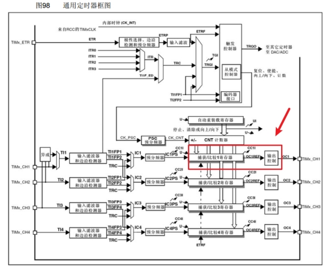 

 

 

 

 

 

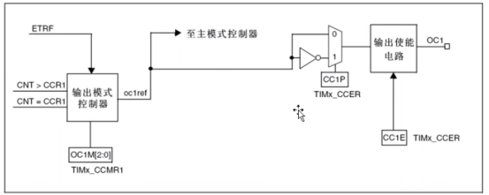 

 

 

它俩进行比较，当CNT>CCR1，或者CNT=CCR1时，就会给这个输出模式控制器传一个信号

**输出比较模式**

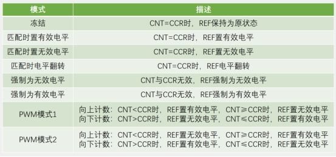 

 

比如你正在输出PWM波，突然想暂停一会儿输出，就可以设置成这个模式，一但切换为冻结模式后，输出就暂停了，并且高低电平也维持为暂停时刻的状态，保持不变。

 

有效电平和无效电平是高级定时器才有的说法，是和关断、刹车这些功能配合表述的，它说的比较严谨，这里理解成高电平和低电平就可以了，这些函数就可以输出高低电平了，但是只能输出一次占空比为50%的PWN波形，电平翻转有用一点， 有效和无效电平没什么用（一次性的），不适合输出连续变化的波形，比如你设置CCR为0，那CNT每次更新清O时，就会产生一次CNT=CCR的事件，这就会导致输出电平翻转一次，每更新两次，输出为一个周期，并且高电平和低电平的时间是始终相等的，也就是占空比始终为50%，当你改变定时器更新频率时，输出波形的频率也会随之改变，它俩的关系是输出波形的频率=更新频率/2。

 

 

和暂停模式差不多，在暂停模式期间，输出高电平或者低电平

 

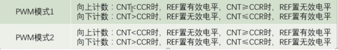 

一般只使用其中的一个计数模式，只有大小和极性的不同，模式1是模式2的取反的

 

**PWM基本结构**

 

并且，它的占空比是受CCR值的调控的

 

 

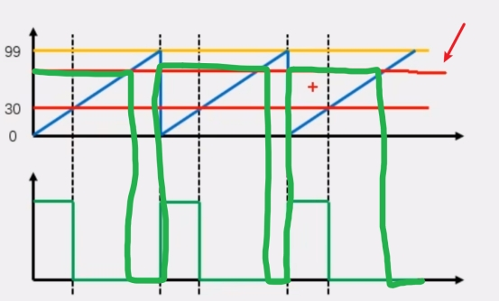 

如果CCR设置高一些，输出的占空比就变大，CCR设置的低一些，输出的占空比就变小，这里REF，就是一个频率可调，占空比也可调的PWM波形，最终再经过极性选择，输出使能，最终通向GPIO口。

 

 

 

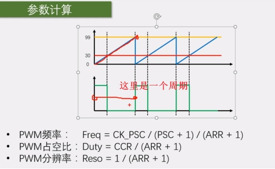 

 

公式重要

 

 

 

 

 

 

**PWM的频率就等于计数器的更新频率**，就是计数器的更新频率公式

 

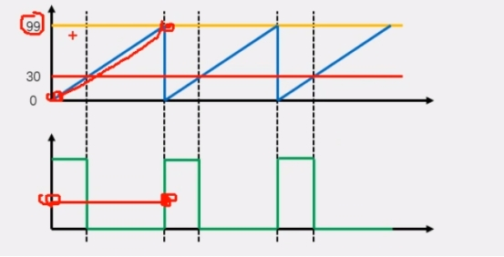 

 

 

那CNT总共就是计了100个数，PWM占空比: Duty = CCR/ (ARR + 1)，高电平的时间，CNT是从O一直加到CCR，比如CCR是30，所以CNT从0到29是高电平，总共是30个数的时间，所以这里占空比就是30/100=30%。

 

 

总结一下公式就是占空比=CCR/(ARR +1)

 

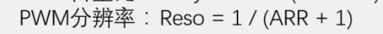 

PWM分辨率: Reso = 1/ (ARR + 1)

 

 

CCR=ARR+1时，占空比就正好是100%

 

 

所以CCR的变化范围取决于ARR的值

 

 

 

ARR越大，CCR的范围就越大，对应的分辨率就越大，注意这里我定义的分辨率是占空比最小的变化步距，APR的这个值是越小越好，你也可以把CCR的范围定义成分辨率，那就是值越大越好，总之就是占空比变化的越细腻，越好，如果我要求你输出一个频率为1KHz，占空比可任意调节，且分辨率为1%的PWM波形。

**输出比较通道(高级)**

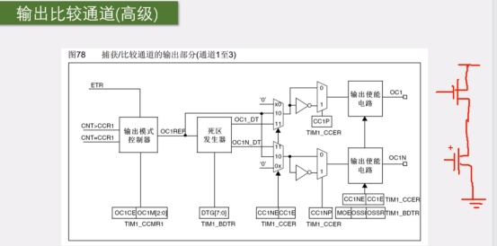 

 

 

上面是正极，接着是一个大功率开关管，一般都是MOS管，就是一种大功率电子开关，MOS管左边是控制极，比如说给高电平右边两根线就导通，低电平就断开，这就是一个最基本的推挽电路，中间是输出，如果上管导通，下管断开，那输出就是高电平，如果下管导通，上管断开，那输出就是低电平。

如果上下管都导通，那就是电源短路，这样是不允许的，如果上下管都断开，那输出就是高阻态，这就是推挽电路的工作流程，如果有两个这样的推挽电路，那就构成了H桥电路，如果有三个这样的推挽电路，那就可以用于驱动三相无刷电机了，如果直接用单片机来控制的话，那就需要两个控制极。

并且这两个控制极电平是相反的，也就是互补，因为上管导通，下管就必须断开，下管导通，上管就必须断开，首先这个OC1和OC1N就是两个互补的输出端口，然后是在切换上下管导通状态时，如果在上管关断的瞬间，下管立刻就打开，那可能会因为器件的不理想，上管还没完全关断，下管就已经导通了，出现了短暂的上下管同时导通的现象，这会导致功率损耗，引起器件发热，所以在这里为了避免这个问题，就有了死区生成电路，它会在上管关闭的时候，延迟一小段时间，再导通下管，这样就可以避免上下管同时导通的现象了。

 

 

**舵机简介**

 

它有三根输入线，两根是电源线，一根是信号线

 

 

我们的PWM就是输入到这个信号线，来控制舵机的

 

这就是舵机的工作方式

 

然后中间这个是舵机的一个拆解图

 

舵机上盖、输出轴、减速齿轮组

 

下面这里是直流电机、舵机控制板、电位器

 

可以看出，舵机其实并不是一种单独的电机

 

 

它的内部是由直流电机驱动的

 

 

它里面还有一个控制电路板，是一个电机的控制系统

 

 

PWM信号输入到控制板，给控制板一个指定的目标角度

 

 

然后，这个电位器检测输出轴的当前角度

 

 

如果大于目标角度，电机就会反转

 

 

如果小于目标角度，电机就会正转

 

 

最终使输出轴固定在指定角度

 

 

这就是舵机的内部工作流程

舵机是一种根据输入PWM信号占空比来控制输出角度的装置，输入PWM信号要求:周期为20ms,高电平宽度为0.5ms~2.5ms，可以用PWM信号来控制舵机输出轴的角度

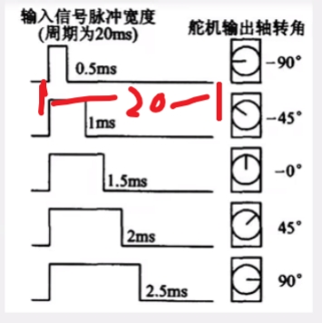 

就是说20ms里面有0.5ms为高电平就是转到负90度的位置

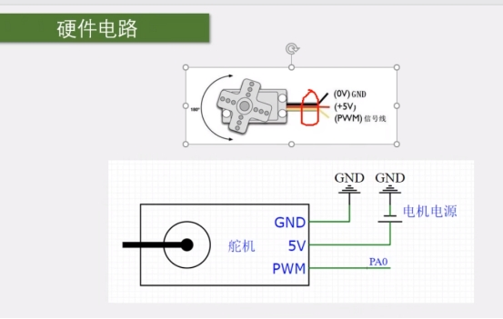 

舵机的时候用的时候，要外部去供电，不要用单片机的供电去搞，没电的时候，转动电机会产生较大的电流回到单片机，单独供电的时候，这个地平面也要单片机的共地才行

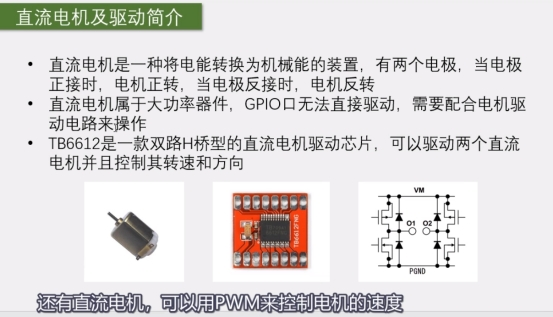 

**电机驱动方案**

比如**TB6612**、DRV8833、L9110、L298N等等，mos管来搭电路，功率可以做到很大，这个芯片里面是有两路驱动电路的，可以独立地控制两个电机，像有些芯片，比如ULN2003，它里面一路就只有一个开关管，所以它就只能控制电机在一个方向转，上面的芯片就是TB6612，外围电路就只需要三个滤波电容就行了

直流电机是一种将电能转换为机械能的装置，有两个电极，当电极正接时，电机正转，当电极反接时，电机反转

直流电机属于大功率器件，GPIO口无法直接驱动，需要配合电机驱动电路来操作

TB6612是一款双路H桥型的直流电机驱动芯片，可以驱动两个直流电机并且控制其转速和方向

 

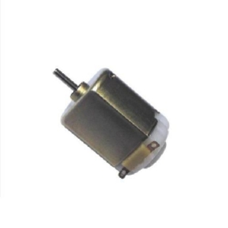 

 

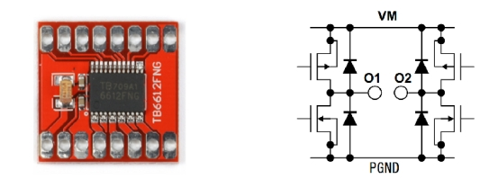 

 

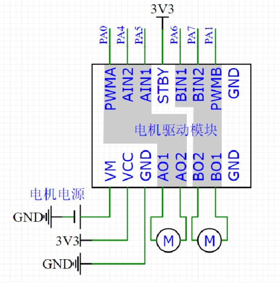 

 

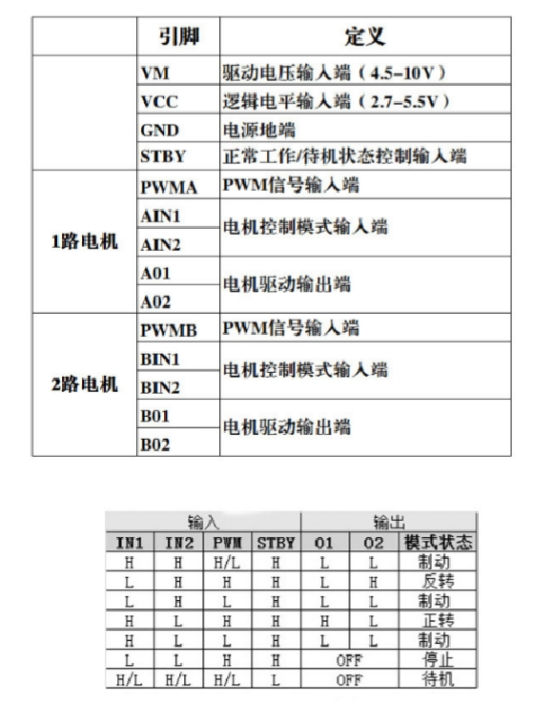 

 

 

比如如果你是5V的电机，这里就接5V

 

然后下一个引脚是VCC，这个是逻辑电平输入端，范围是2.7到5.5V

 

这个要和我们控制器的电源保持一致

 

 

比如你使用STM32，是3.3V的器件，那就接3.3V

 

 

如果是51单片机，是5V的器件，那就接5V

 

 

这个引脚并不需要大功率，所以可以和控制器共用一个电源

 

 

然后第三个引脚是GND，这个就接系统的负极就行了

 

 

然后继续看，这里AO1、AO2、BO1、BO2就是两路电机的输出了

 

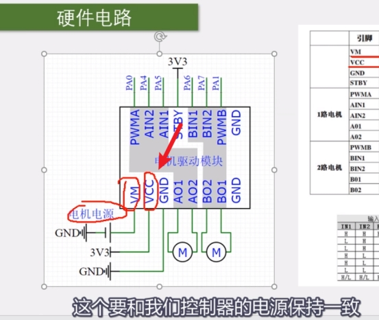 

 

 

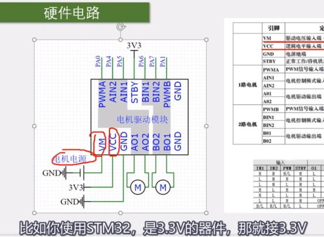 

 

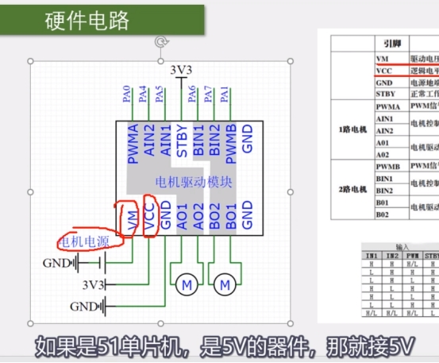 

 

 

这个引脚并不需要大功率，所以可以和控制器共用一个电源

 

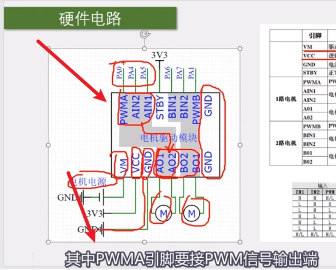 

 

 

 

 

然后继续看，这里AO1、AO2、BO1、BO2就是两路电机的输出了

 

 

AO1和AO2就是A路的两个输出，它的控制端就是上面的这三个

 

 

PWMA、AIN2和AIN1，这三个引脚控制下面A路的一个电机

 

驱动电路就会从VM汲取电流，来输出到电机

 

这样就能完成低功率的控制信号控制大功率设备的目的了

 

 

BO1和BO2是B路的两个输出

 

 

它的控制端是上面右边的BIN1、BIN2和PWMB这三个引脚

 

 

两路的功能和操作方法是完全一样的

 

 

最后还剩一个STBY（Stand By）引脚，这个是待机控制脚

 

 

如果接GND，芯片就不工作，处于待机状态

 

 

如果接逻辑电源VCC，芯片就正常工作

 

 

这个引脚如果不需要待机模式的话，可以直接接VCC,3.3V

 

 

如果需要的话，可以任意接一个GPIO，给高低电平就可以控制了

 

 

STBY低电平就待机，高电平就正常工作，这个不用看了

 

 

然后右边是输出，oo1、oo2和模式状态

 

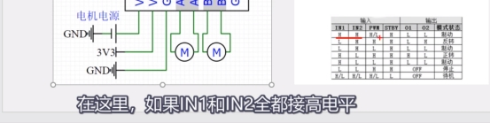 

 

 

两个输出就都为低电平，这样两个输出没有电压差，电机是不会转的，

 

 

输出直接关闭，这样电机也是不会转的，

 

那剩下的就只有一高一低了，是吧，

 

 

这里如果IN1给低电平，IN2给高电平，

 

 

电机就是处于反转状态，

 

 

那转还是不转呢，要取决于PWM

 

 

如果PWM给高电平，那输出就是一低一高

 

 

有电压差了，电机可以转，这时候定义的是反转，开始转了

 

 

如果PWM给低电平，那输出两个低电平，电机还是不转

 

 

这就是反转的逻辑

 

 

IN1给低，IN2给高，PWM高转低不转

 

 

那电机不就是快速地反转、停止、反转、停止了嘛

 

 

如果PWM频率足够快，那电机就可以连续稳定地反转了

 

 

并且速度取决于PWM信号的占空比

 

 

在这里的PWM，就是我们之前讲的，使用PWM来等效一个模拟量的功能了

 

 

这样电机就是正转状态，那是转还是不转，要取决于PWM信号

**需要的特别引脚才能驱动吗**

需要,不同和ESP32任何引脚都可以作为pwn输出，但是只能输出pwn的个数是有限制的

**代码**

PWN代码部分

[[6-4\] PWM驱动LED呼吸灯&PWM驱动舵机&PWM驱动直流电机_哔哩哔哩_bilibili](https://www.bilibili.com/video/BV1th411z7sn?p=16&spm_id_from=pageDriver&vd_source=5e12cc40b4cf9bc1265b996e2d71fa81)