[[7-1\] ADC模数转换器_哔哩哔哩_bilibili](https://www.bilibili.com/video/BV1th411z7sn?p=21&spm_id_from=333.880.my_history.page.click)

### **ADC** 

ADC (Analog-Digital Converter）模拟-数字转换器

ADC可以将引脚上连续变化的模拟电压转换为内存中存储的数字变量，建立模拟电路到数字电路的桥梁

**12位逐次逼近型ADC**, 1us转换时间输入电压范围：**0~3.3V（也要根据参考电压来判断），转换结果范围：0~4095**

18个输入通道，可测量16个外部和2个内部信号源（内部温度传感器和内部参考电压）

规则组和注入组两个转换单元

模拟看门狗自动监测输入电压范围

### **STM32F103C8T6** 

ADC资源： ADC1、ADC2, 10个外部输入通道

 

 

第一个是位数

位数越高，量化结果就越精细，对应分辨率就越高

STM32的ADC是12位的，所以AD结果最大值是4095，也就是2^12-1

**转换结果范围：0~4095**

 

 

第二个是转换时间，就是转换频率，AD转换是需要花一小段时间的，这里1us就表示从AD转换开始到产生结果，需要花1us的时间，对应AD转换的频率就是1MHz，最大的范围就是3.3v，超过这个值可能会烧坏芯片，外部信号源就是16个GPIO口，在引脚上直接接模拟信号就行了

 

 

 

2个内部信号源是内部温度传感器和内部参考电压，温度传感器可以测量CPU的温度，比如你电脑可以显示一个CPU温度，内部参考电压是一个1.2V左右的基准电压，这个基准电压是不随外部供电电压变化而变化的，所以如果你芯片的供电不是标准的3.3V，那测量外部引脚的电压可能就不对，这时就可以读取这个基准电压进行校准，这样就能得到正确的电压值了

 

 

### **规则组和注入组**

规则组和注入组两个转换单元，普通的AD转换流程是，启动一次转换、读一次值，但是STM32的ADC就比较高级，**可以列一个组，一次性启动一个组，连续转换多个值，并且有两个组**，一个是用于常规使用的规则组，一个是用于突发事件的注入组

### **模拟看门狗**

模拟看门狗自动监测输入电压范围，这个ADC，一般可以用于测量光线强度、温度这些值，并且经常会有个需求，就是如果光线高于某个阈值、低于某个阈值或者温度高于某个阈值、低于某个阈值时，执行一些操作，就可以用模拟看门狗来自动执行，模拟看门狗可以监测指定的某些通道，当AD值高于它设定的上阈值或者低于下阈值时，它就会申请中断，你就可以在中断函数里执行相应的操作，样你就不用不断地手动读值，再用if进行判断。

### **STM32F103C8T6 ADC资源**

ADC1、ADC2, 10个外部输入通道，它的 ADC资源有ADC1、ADC2，共有两个ADC外设，10个外部输入通道，**也就是它最多只能测量10个外部引脚的模拟信号**，18个输入通道，可测量16个外部和2个内部信号源，但是我们这个芯片引脚比较少，有很多引脚没有引出来

 

## **逐次逼近型ADC**

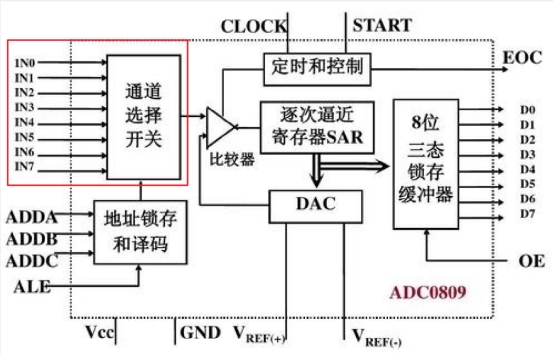 

 

以前的单片机性能不是很强,所以需要外挂一个ADC芯片才能进行AD转换

首先左边这里INO~IN7，是8路输入通道,通过通道选择开关，选中一路，输入到这个点进行转换

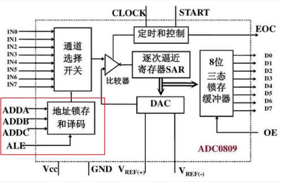 

 

下面这里是地址锁存和译码,就是你想选中哪个通道，就把通道号放在这三个脚上,然后给一个锁存信号，上面这里对应的通路开关就可以自动拨好了,这部分就相当于一个可以通过模拟信号的数据选择器,因为ADC转换是一个很快的过程,你给个开始信号，过几个us就转换完成了,所以说如果你想转换多路信号，那不必设计多个AD转换器,只需要一个AD转换器，然后加一个多路选择开关,想转换哪一路，就先拨一下开关，选中对应通道，然后再开始转换就行了.这就是这个输入通道选择的部分

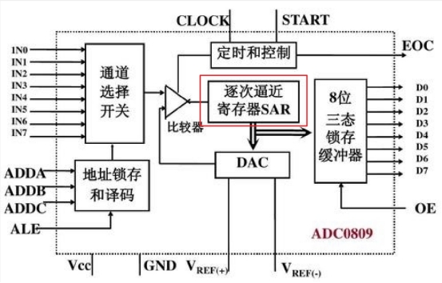 

ADC0809是老芯片，现在一般mcu内部都会集成adc，然后让用户通过软件去调用给

这个ADC0809只有8个输入通道，这就需要我们用逐次逼近的方法来——比较了，首先这是一个电压比较器，它可以判断两个输入信号电压的大小关系，DAC是给他一个数字，就能输出模拟量出来，那现在，我们有了一个外部通道输入的，未知编码的电压，和一个DAC输出的，已知编码的电压，它俩同时输入到电压比较器，进行大小判断，反之则相反，直到DAC输出的电压和外部通道输入的电压近视相等，这样DAC输入的数据就是外部电压的编码数据了，这个电压调节的过程就是这个逐次逼近SAR来完成的，

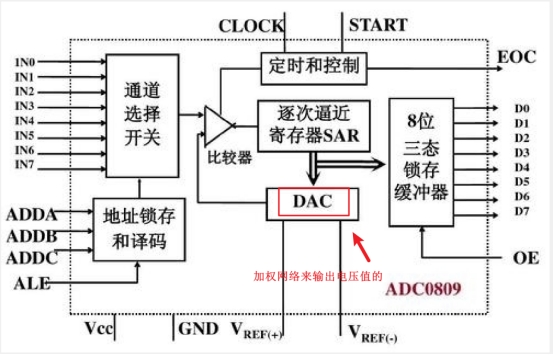 

可以看51里面的DA/AD的那一节

 

 

首先这是一个电压比较器，它可以判断两个输入信号电压的大小关系，输出一个高低电平指示谁大谁小，它的两个输入端，一个是待测的电压，另一个是这里DAC的电压输出端，DAC是数模转换器，我们之前说过了，给它一个数据，它就可以输出数据对应的电压，DAC内部是使用加权电阻网络来实现的转换，如果DAC输出的电压比较大，我就调小DAC数据，如果DAC输出的电压比较小，我就增大DAC数据，直到DAC输出的电压和外部通道输入的电压近视相等，这样DAC输入的数据就是外部电压的编码数据了，这个电压调节的过程就是这个逐次逼近SAR来完成的。

 

### **逐次逼近型的实现原理**

 

 

为了最快找到未知电压的编码，通常我们会使用二分法进行寻找，比如这里是8位的ADC，那编码就是从0~255，第一次比较的时候，我们就给DAC输入255的一半，进行比较，那就是128，然后看看谁大谁小，如果DAC电压大了，第二次比较的时候，再就给128的一半，64，如果还大，第三次比较的时候就给32，如果这次DAC电压小了，那第四次就给32到64中间的值，然后继续，这样依次进行下去，就能最快地找到未知电压的编码，你会发现，128、64、32这些数据，正好是二进制每一位的位权，对二进制从高位到低位依次判断是1还是0的过程，这就是逐次逼近型名字的来源，那对于8位的ADC，从高位到低位依次判断8次就能找到未知电压的编码了，STM32的ADC是12位的，所以AD结果最大值是4095，也就是2^12-1，所以ADC其实就是一个电压表，把引脚的电压值测出来，放在一个变量里，那然后，AD转换结束后，DAC的输入数据，就是未知电压的编码，通过这里进行输出，8位就有8根线，12位就有12根线。

 

 

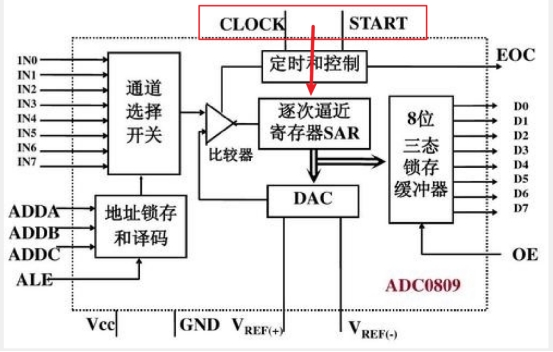 

START是开始转换，给一个输入脉冲，开始转换，CLOCK是ADC时钟，**因为ADC内部是一步一步进行判断的，所以需要时钟来推动这个过程**

 

 

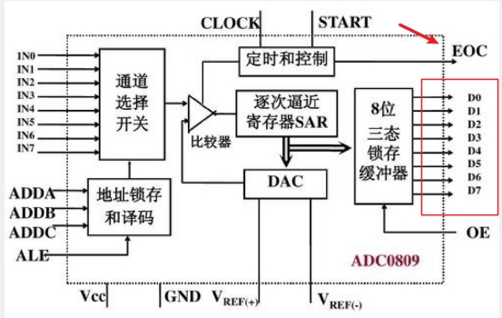 

 

通过这里进行输出，8位就有8根线，12位就有12根线,EOC是End Of Convert，转换结束信号

 

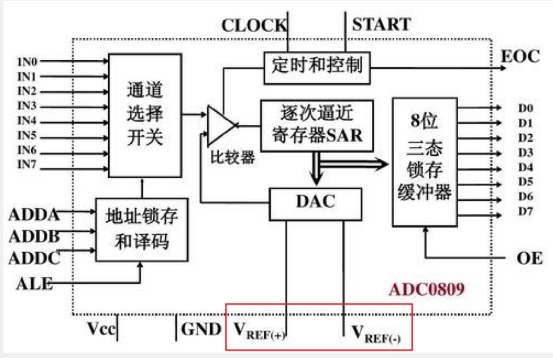 

一般VREF+接VCC,VREF-接地就可以测量0到3.3v的电压了

下面，VREF+和VREF-是DAC的参考电压，比如你给一个数据255，是对应5V还是3.3V呢，这个DAC的参考电压也决定了ADC的输入范围，所以它也是ADC参考电压，

 

**通常参考电压的正极和VCC是一样的，会接在一起，参考电压的负极和GND也是一样的，也接在一起**

所以一般情况下，ADC输入电压的范围就和ADC的供电是一样的，看看STM32的ADC和这个相比，有什么更高级的变化

## **STM32的逐次逼近型ADC框图**

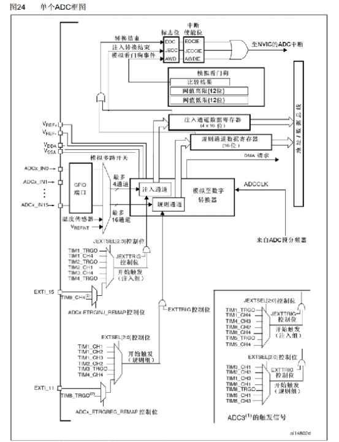 

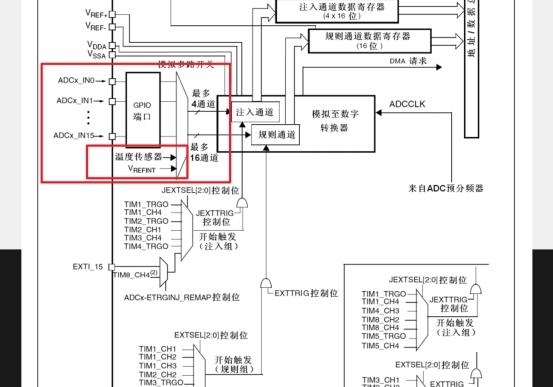 

16个adc加上一个温度传感器和内部参考电压

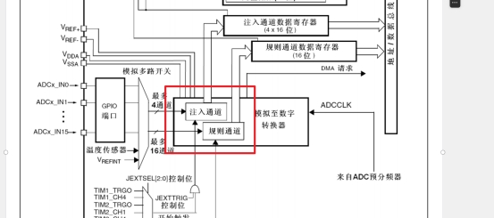 

接着我们着一下注入组，这个组就比较高级了，它相当于是餐厅的VIP座位，在这个座位上，一次性最多可以点4个菜，并且这里数据寄存器有4个，是可以同时上4个菜的，对于注入组而言，就不用担心数据覆盖的问题了，如果要使用规划组的菜单，那就再配合DMA转运数据，这样就不用担心数据覆盖的问题了，

所以接下来我就只讲规则组的操作，那对于STM32的ADC，触发ADC开始转换的信号有两种，一种是**软件触发**，就是你在程序中手动调用一条代码，就可以启动转换了，另一种**是硬件触发**，就是这里的这些触发源。

 

 

但是这里就比较高级了，它可以同时选中多个，而且在转换的时候，还分成了两个组，规则通道组和注入通道组，其中规则组可以一次性最多选中16个通道，注入组最多可以选中4个通道，所以对于规则组转换来说，如果使用这个菜单的话，最好配合DMA来实现，DMA是一个数据转运小帮手，它可以在每上一个菜之后把这个菜挪到其他地方去,防止被覆盖，但是数据寄存器只能存一个结果，如果不想之前的结果被覆盖，就必须尽快的拿走结果。

**规则组的寄存器只有一个，采集到数据要立马搬走，不然会被覆盖掉。可以配合DMA来去实现**

 

 

 

上面这些是注入组的触发源，下面这些是规则组的触发源。

定时器可以通向ADC、DAC这些外设，用于触发转换，那因为ADC经常需要过一个固定时间段转换一次，正常的思路就是，用定时器，每隔1ms申请一次中断，在中断里手动开始一次转换，这样也是可以的，但是频繁进中断对我们的程序是有一定影响的，比如你有很多中断都需要频繁进入，那肯定会影响主程序的执行，并且不同中断之间，由于优先级的不同，也会导致某些中断不能及时得到响应，如果触发ADC的中断不能及时响应，那我们ADC的转换频率就肯定会产生影响了，“所以对于这种需要频繁进中断，并且在中断里只完成了简单工作的情况，一般都会有硬件的支持，比如这里，就可以给TIM3定个1ms的时间，并且把TIM3的更新事件选择为TRGO输出，然后在ADC这里，选择开始触发信号为TIM3的TRGO，只要有一个更新事件，转换自动完成

 

 

一般情况下，VREF+要接VDDA,VREF-要接VSSA，VDDA和VSSA是内部模拟部分的电源

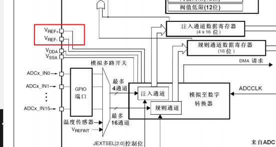 

 

 

 

在这里VDDA接3.3V，VSSA接GND，所以ADC的输入电压范围就是0~3.3V

 

 

这个ADC预分频器是来源于RCC的

 

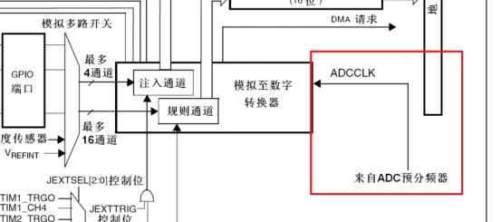 

 

 

（缺了一张图）

 

如果选择2分频，72M/2=36M，超出允许范围了的，所以对于ADC预分频器；只能选择6分频，结果是12M和8分频，结果是9M，这两个值，这个就是用于触发DMA进行数据转运的，我们下节再讲

 

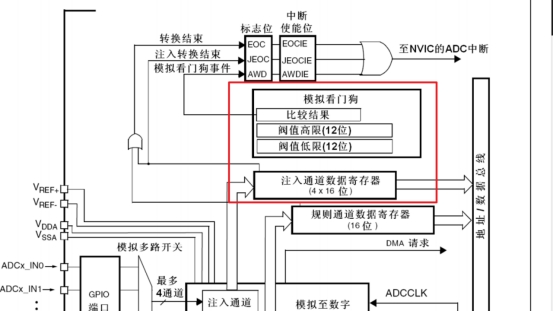 

 

它里面可以存一个阈值高限和阈值低限，如果启动了模拟着门狗，并指定了看门的通道，那这个看门狗就会关注它看门的通道，一但超过这个阈值范围了，它就会乱叫，就会在上面，申请一个模拟看门狗的中断，最后通向NVIC。然后对于规则组和注入组而言呢，它们转换完成之后，也会有一个EOC转换完成的信号，在这里，EOC是规则组的完成信号，JEOC是注入组完成的信号，这两个信号会在状态寄存器里置一个标志位，我们读取这个标志位，就能知道是不是转换结束了，同时这两个标志位也可以去到NVIC，申请中断。如果开启了NVIC对应的通道，它们就会触发中断

## **STM32的ADC基本结构**

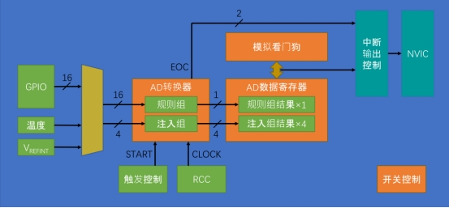 

 

左边是输入通道，16个GPIO口，外加两个内部的通道，AD转换器里有两个组，一个是规则组，一个是注入组，规则组最多可以选中16个通道，注入组最多可以选择4个通道，其中规则组只有1个数据寄存器，注入组有4个，硬件触发主要是来自于定时器，当然也可以选择外部中断的引脚，触发控制可以选择软件触发和硬件触发，右边这里是来自于RCC的ADC时钟CLOCK，ADC逐次比较的过程就是由这个时钟推动的

然后上面，可以布置一个模拟看门狗用于监测转换结果的范围，如果超出设定的阈值，就通过中断输出控制，向NVIC申请中断

在库函数中，就是ADC_Cmd函数，用于给ADC上电的

 

 

 

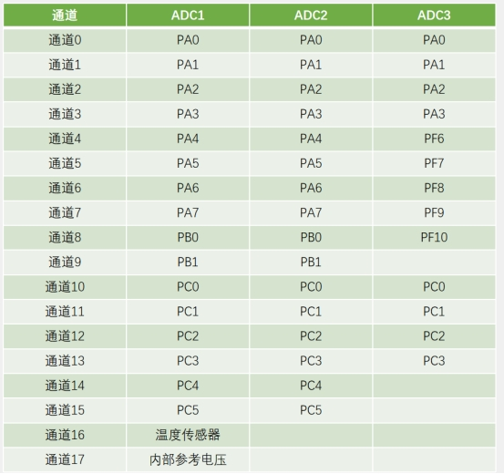 

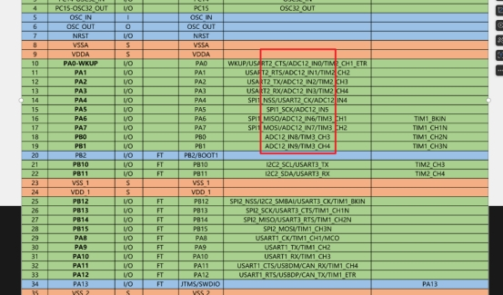 

这个ADC12_INO的意思是，ADC1和ADC2的INO都是在PAO上的，然后下面全都是ADC12；这说明ADC1和ADC2的引脚全都是相同的，就是双ADC模式，这个模式比较复杂。

 

**双ADC模式就是ADC1和ADC2一起工作，它俩可以配合组成同步模式、“交叉模式等等模式，比如交叉模式，ADC1和ADC2交叉地对一个通道进行采样，这样就可以进一步提高采样率。连续打拳似的采样，这就是ADC1和ADC2配合使用的双ADC模式，这里只有ADC1有通道16和17，ADC2和ADC3是没有的**

ADC1和ADC2的引脚是完全相同的，ADC3中间会有些变化，不过我们这个芯片也没有ADC3，不用管的，这里引脚的顺序就是PAO~PA7，然后PBO~PB1，再然后PCO~PC5，由于我们这个芯片没有PCO~PC5，所以这些通道也就没有了。

## **转换模式**

接下来，我们再来了解一下规则组的4种转换模式，那在我们ADC初始化的结构体里，会有两个参数，一个是选择单次转换还是连续转换的，另一个是选择扫描模式还是非扫描模式的，

**组合起来就是ADC的四种模式**

### **单次转换，非扫描模式**

扫描就是扫描管道结束后，然后置位EOC，我们只需要扫描EOC就可以了

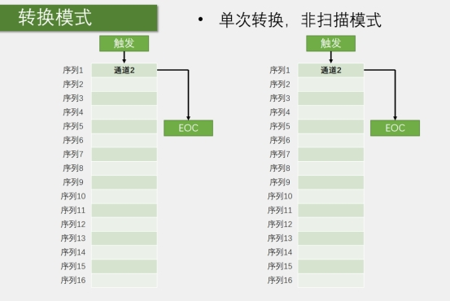 

这里我画了一个列表，这个表就是规则组里的菜单，有16个空位，分别是序列1到序列16，你可以在这里“点菜”，就是写入你要转换的通道，在非扫描的模式下，这个菜单就只有第一个序列1的位置有效，选择一个通道就可以转换了，转换完成后EOC置位，把数据发到数据寄存器里面去，然后，我们就可以触发转换，ADC就会对这个通道2进行模数转换，转换结果放在数据寄存器里，同时给EOC标志位置1，我们判断这个EOC标志位，如果转换完了，那我们就可以在数据寄存器里读取结果了。

### **连续转换，非扫描模式**

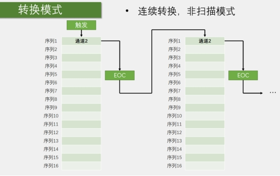 

首先，它还是非扫描模式，所以菜单列表就只用第一个，然后它与上一种单次转换不同的是，它在一次转换结束后不会停止，而是立刻开始下一轮的转换，然后一直持续下去，这样就只需要最开始触发一次，之后就可以一直转换了，

这个模式的好处就是，开始转换之后不需要等待一段时间的，因为它一直都在转换，所以你就不需要手动开始转换了，也不用判断是否结束的，想要读AD值的时候，直接从数据寄存器取就是了。

### **单次转换，扫描模式**

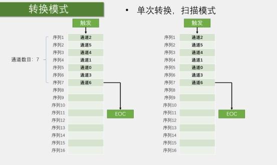 

初始化结构体里还会有个参数，就是通道数目，首选你可以去指定去扫描哪些通道目，其次就可以选择通道的数目，16个位置可以不用用完，可以指定前几个通道。然后转换结果都放在寄存器里面求，这里为了防止数据被覆盖，就需要用DMA及时将数据挪走，那7个通道转换完成之后，产生EOC信号，转换结束，当然在扫描模式的情况下，还可以有一种模式，叫间断模式，它的作用是，在扫描的过程中，每隔几个转换，就暂停一次，这个模式我没有列出来，要不然模式太多了，可以不用去掌握，第一个是触发控制，这个我们刚才讲过。

 

### **连续转换，扫描模式**

 

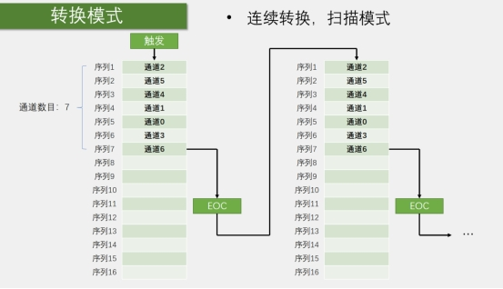 

## **数据对齐**

 

 

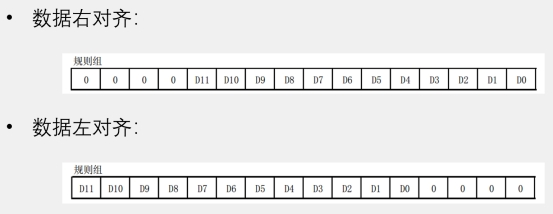 

 

但是这个数据寄存器是16位的，所以就存在一个数据对齐的问题，我们这个ADC是12位的，它的转换结果就是一个12位的数据，但是这个数据寄存器是16位的，所所以就存在一个数据对齐的问题。

## **触发控制的（没有细讲）**

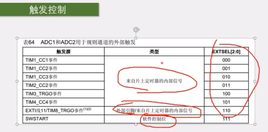 

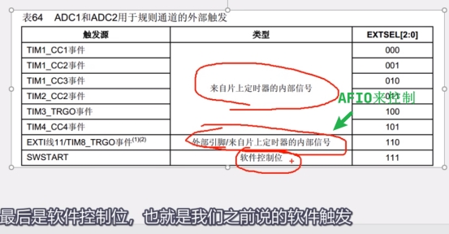 

### **数据右对齐**

这里第一种是数据右对齐，就是12位的数据向右靠，高位多出来的几位就补0。

### **数据左对齐**

 

第二种是数据左对齐，是12位的数据向左靠，在这里我们一般使用的都是第一种右对齐，这样读取这个16位寄存器，直接就是转换结果，如果选择左对齐，直接读的话，得到的数据会比实际的大，因为数据左对齐实际上就是把数据左移了4次，二进制有个特点，就是数据左移一次，就等效于把这个数据乘2，那这里左移4次，就相当于把结果乘16了，

这个是用途就是，如果你不想要这么高的分辨率，你觉得0~4095数太大了，我就做个简单的判断，不需要这么高分辨率，这个12位的ADC就退化成了8位的ADC了

## **转换时间**

 

我们一般不太敏感，因为一般AD转换都很快，如果不需要非常高速的转换频率，那转换时间就可以忽略了，这是因为，我们的AD转换，就是后面的量化编码，是需要一小段时间的，

 

如果在这一小段时间里，输入的电压还在不断变化，

 

 

 

那就没法定位输入电压到底在哪了是吧，

 

 

 

 

 

所以在量化编码之前，我们需要设置一个采样开关，先打开采样开关，收集一下外部的电压，比如可以用一个小容量的电容存储一下这个电压，存储好了之后，断开采样开关，再进行后面的AD转换，这样在量化编码的期间，电压始终保持不变，这样才能精确地定位未知电压的位置，这就是采样保持电路，那采样保持的过程，需要闭合采样开关，过一段时间再断开，这里就会产生一个采样时间。

 

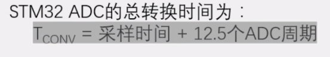 

 

采样时间越大，越能避兔一些毛刺信号的干扰，

 

 

不过转换时间也会相应延长，

 

 

因为是12位的ADC，所以需要花费12个周期，

 

 

这里多了半个周期，可能是做其他一些东西花的时间，

 

 

ADC周期就是从RCC分频过来的ADCCLK，

 

 

这个ADCCLK最大是14MHz。

 

 

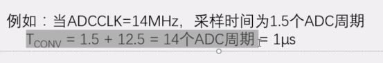 

如果你采样周期再长些，它就达不到1us了

 

 

另外你也可以把ADCCLK的时钟设置超过14MHz

 

 

这样的话ADC就是在超频了，那转换时间可以比lus还短

## **校准**

ADC有一个内置自校准模式。校准可大幅减小因内部电容器组的变化而造成的准精度误差。校准期间，在每个电容器上都会计算出一

个误差修正码(数字值),这个码用于消除在随后的转换中每个电容器上产生的误差，建议在每次上电后执行一次校准，启动校准前， ADC必须处于关电状态超过至少两个ADC时钟周期。

**但是我们不需要理解，这个校准过程是固定的，我们只需要在ADC初始化的最后，加几条代码就行了**

## **硬件**

 

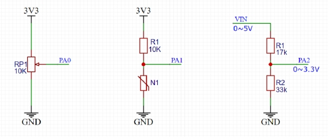 

 

一般来说，像光敏电阻、热敏电阻、红外接收管、麦克风等等，那电阻值没法直接测量，所以这里就可以通过和一个固定电阻串联分压，来得到一个反应电阻值电压的电路，那这里，传感器阻值变小时，下拉作用变强，输出端电压就下降，传感器阻值变大时，下拉作用变弱，输出端受上拉电阻的作用，电压就会升高，这个固定电阻一般可以选择和传感器阻值相近的电阻，这样可以得到一个位于中间电压区域比较好的输出，当然这里传感器和固定电阻的位置也可以换过来，这样的话，输出电压的极性就反过来了。

 

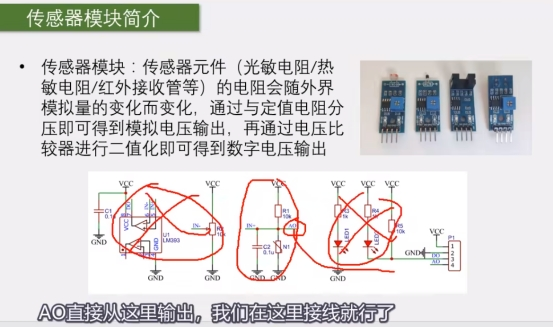 

 

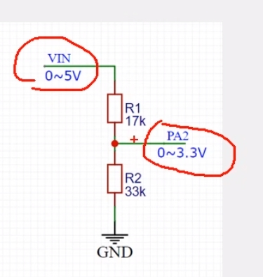 

 

 

IO只能接收0到5v，要电路去实现，这种转换，所以根据分压公式，中间的电压就是VIN/50K×33K，但是如果你电压再高一些，就不建议使用这个电路了，那可能会比较危险，高电压采集最好使用一些专用的采集芯片，比如隔离放大器等等，采样时间短11速度快冲采样时间长，避兔毛刺干扰。

 

 