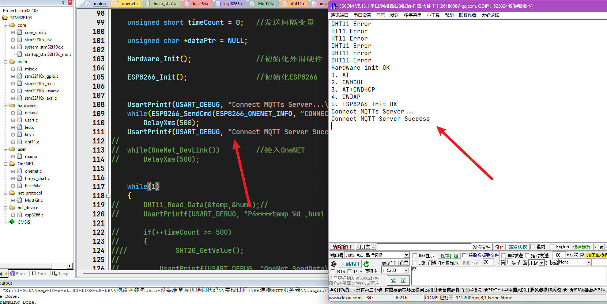

## 1. 修改esp8266.c下的wifi账号及密码

````C

#define WIFI_NAME "ikun"
#define WIFI_PASSWORD "123456789"
#define ESP8266_WIFI_INFO "AT+CWJAP=\"" WIFI_NAME "\",\"" WIFI_PASSWORD "\"\r\n"
````

### 2.修改onenet.c下的PROID、ACCESS_KEY_key和DEVICE_NAME

```


```

2024年3月2日21点40分测试成功，可以连接上mqtt



