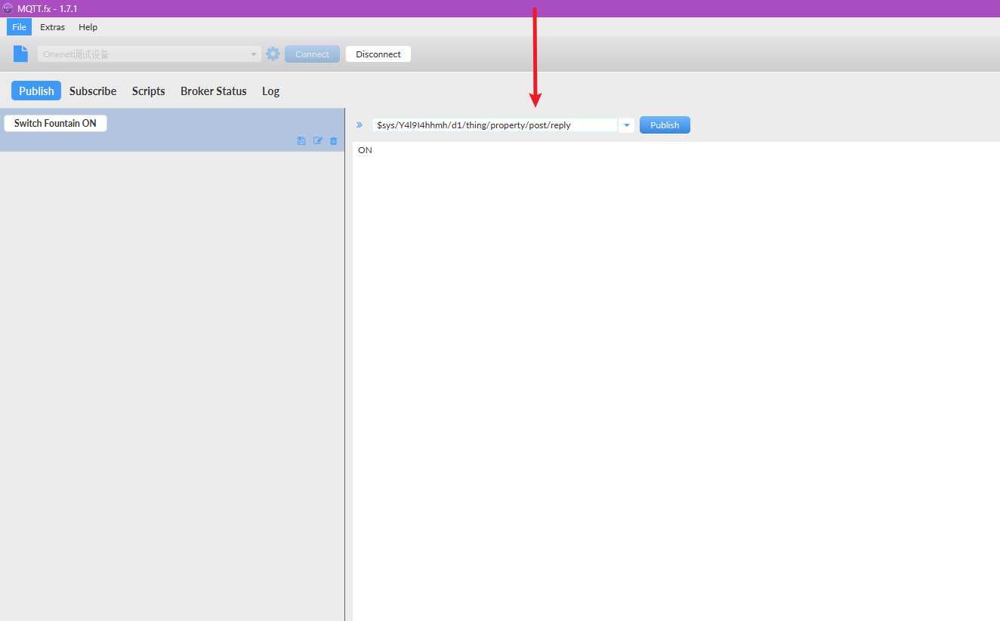
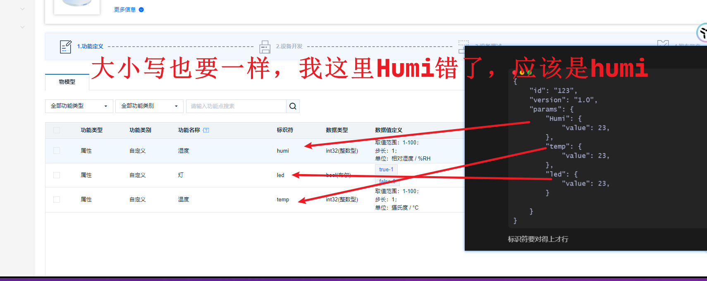
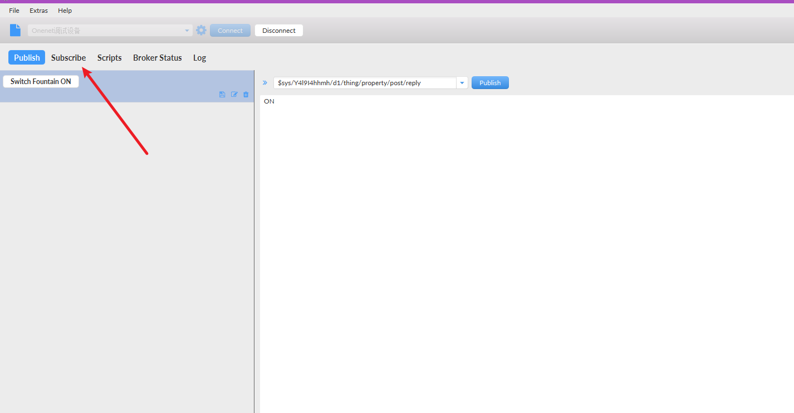
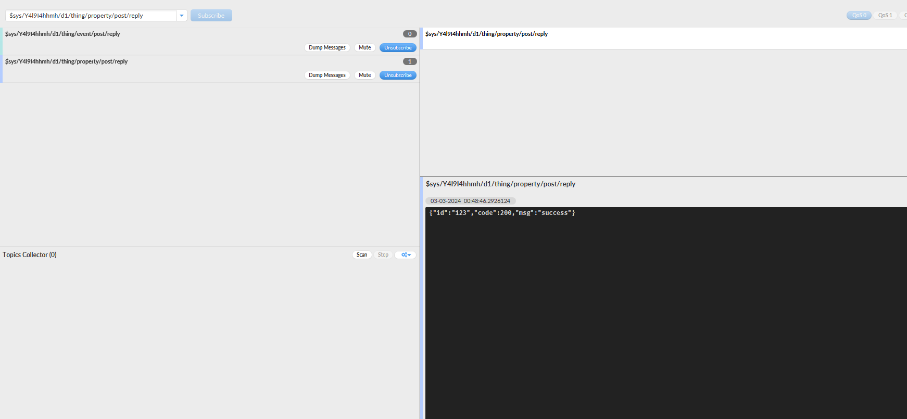
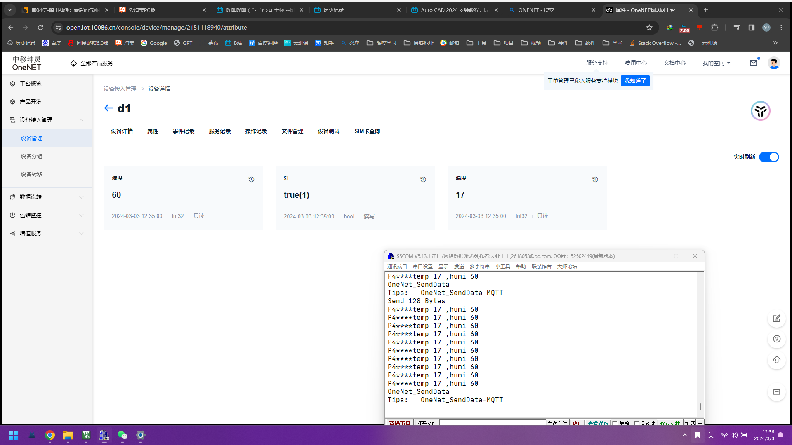

## 1. 修改esp8266.c下的wifi账号及密码

````C

#define WIFI_NAME "ikun"
#define WIFI_PASSWORD "123456789"
#define ESP8266_WIFI_INFO "AT+CWJAP=\"" WIFI_NAME "\",\"" WIFI_PASSWORD "\"\r\n"
````

### 2.修改onenet.c下的PROID、ACCESS_KEY_key和DEVICE_NAME

```C


#define PROID			"Y4l9I4hhmh"

#define ACCESS_KEY		"QU1nNXoxOXJDUEdsSzQ1NVBkaFZ3dzk1NFZSaHZ6SDY=="

#define DEVICE_NAME		"d1"
```


## 模拟数据上传服务器


https://open.iot.10086.cn/doc/v5/fuse/detail/922


```

$sys/{pid}/{device-name}/thing/property/post
```


产品ID


> Y4l9I4hhmh


 设备名称/ID


> d1


```
$sys/Y4l9I4hhmh/d1/thing/property/post
```




----


属性上报的topic为：

```

$sys/{pid}/{device-name}/thing/property/post
```


上报数据成功后，订阅的属性上报会返回success


OneJSON请求数据格式:


```
{
	"id": "123",
	"version": "1.0",
	"params": {
		"Power": {
			"value": "12345",
			"time": 1706673129818
		},
		"temp": {
			"value": 23.6,
			"time": 1706673129818
		}
	}
}
```


标识符要对得上才行




```
{
	"id": "123",
	"version": "1.0",
	"params": {
		"humi": {
			"value": 23
		},
		"temp": {
			"value": 23
		},
		"led": {
			"value": true
		}
		
	}
}
```

> **大小写千万不能弄反了**


还可以订阅一个发送信息，得知结果的消息


**订阅事件上报结果通知消息**


为了确保事件上传消息确实被平台所接受处理，设备可以订阅系统 topic 获取事件上报结果消息，属性上报回复topic为：




```

$sys/{pid}/{device-name}/thing/property/post/reply


```


```
$sys/Y4l9I4hhmh/d1/thing/property/post/reply

```




## 真机设备数据上传服务器

2024年3月3日



