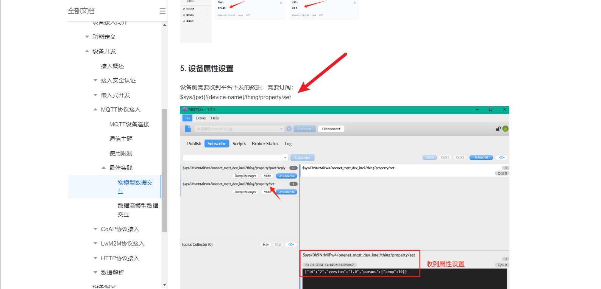
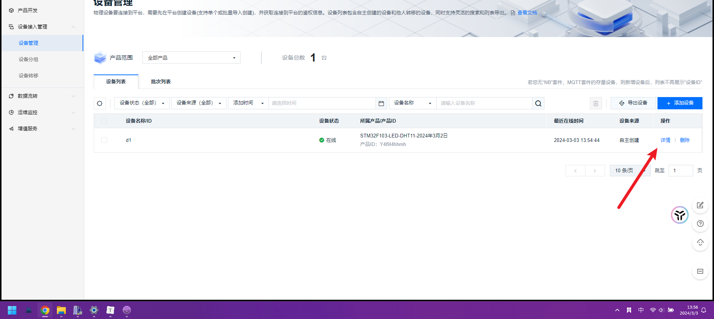
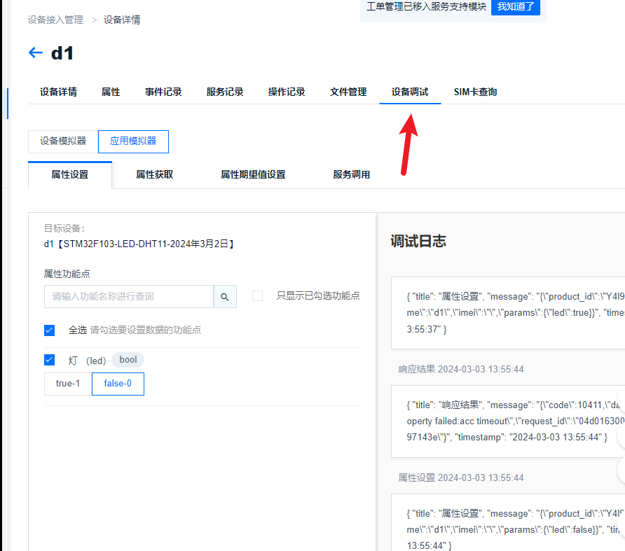
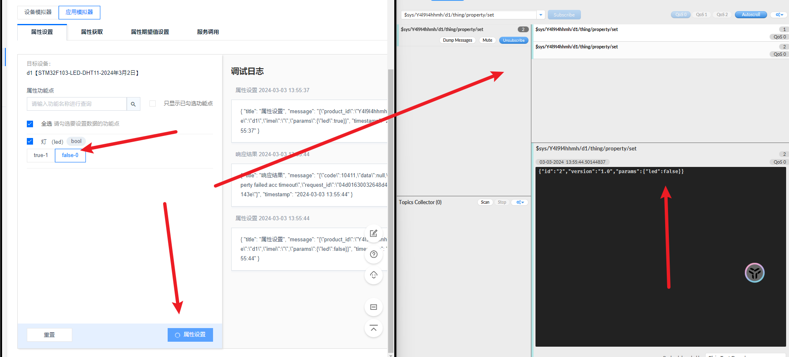
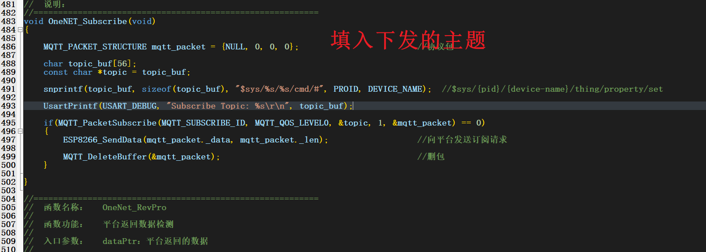
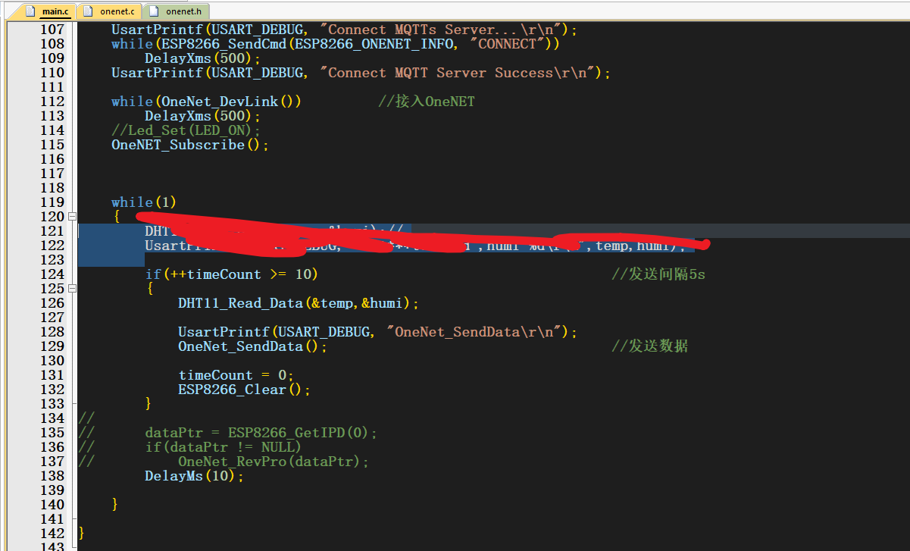
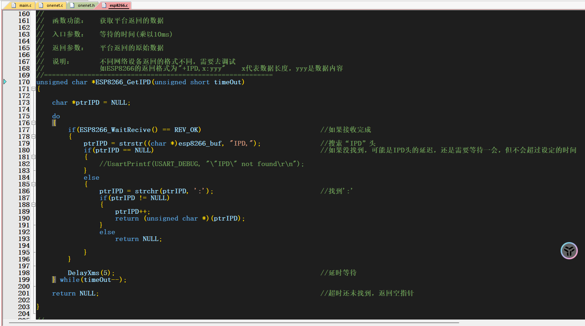
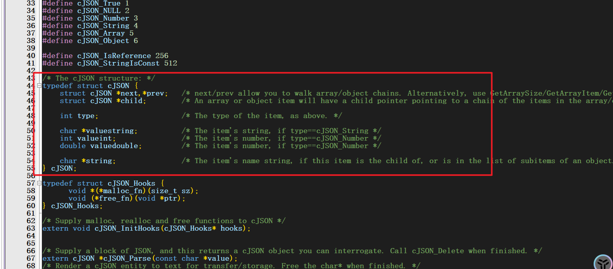
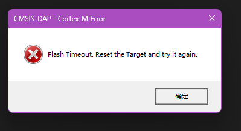
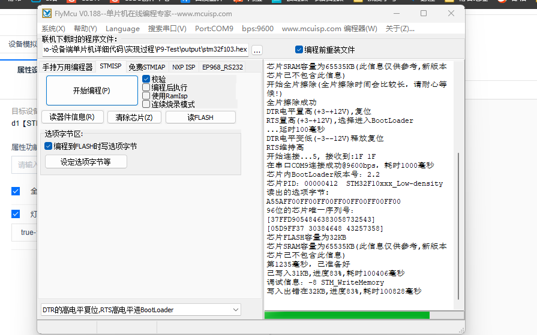

## 1. 修改esp8266.c下的wifi账号及密码

````C

#define WIFI_NAME "ikun"
#define WIFI_PASSWORD "123456789"
#define ESP8266_WIFI_INFO "AT+CWJAP=\"" WIFI_NAME "\",\"" WIFI_PASSWORD "\"\r\n"
````

### 2.修改onenet.c下的PROID、ACCESS_KEY_key和DEVICE_NAME

```C

#define PROID			"Y4l9I4hhmh"

#define ACCESS_KEY		"QU1nNXoxOXJDUEdsSzQ1NVBkaFZ3dzk1NFZSaHZ6SDY=="

#define DEVICE_NAME		"d1"
```

2024年3月2日21点40分测试成功，可以连接上mqtt


## 模拟数据下发服务器


https://open.iot.10086.cn/doc/v5/fuse/detail/922


```
$sys/{pid}/{device-name}/thing/property/set
```


产品ID  pid


> Y4l9I4hhmh


 设备名称/ID  device-name


> d1


```
$sys/Y4l9I4hhmh/d1/thing/property/set
```














## 真机设备数据下发服务器











one内云平台是通过无线网络转发给,发送给esp866ESP866,通过串口转发给大面积,整企下行数据的的流程就是这样的,然后获取到获取到原始数据，再将这个数据进行解析


云平台下发的数据需要通过mqtt进行解包处理

[cJSON download | SourceForge.net](https://sourceforge.net/projects/cjson/)


cjson的精华在结构体




### 移植cjson文件，烧录不进去问题



