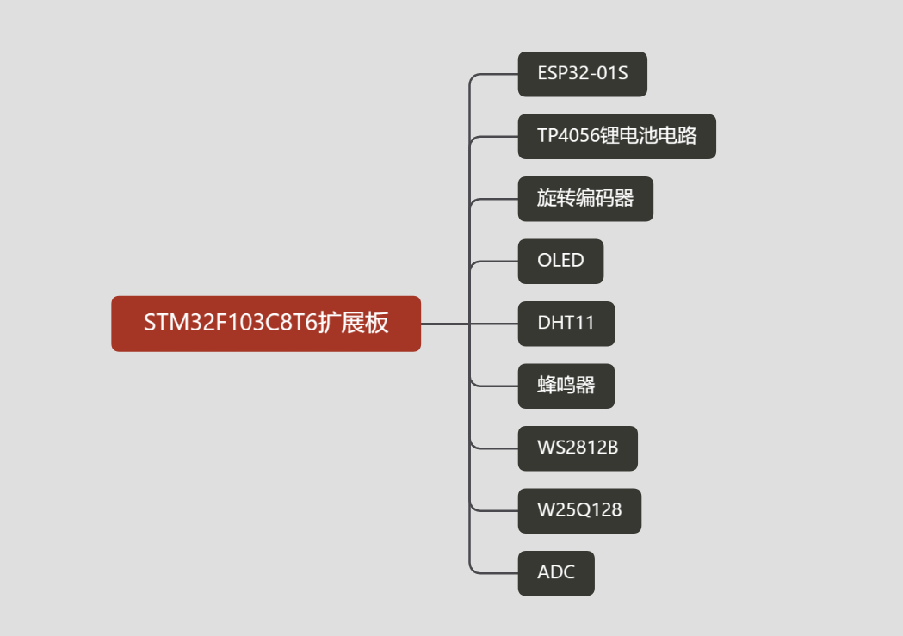

# STM32F103C8T6扩展板最小验证

### 地址

[Yu-1120/STM32F103C8T6-exBoard: STM32F103C8T6扩展板 (github.com)](https://github.com/Yu-1120/STM32F103C8T6-exBoard)

[STM32F103C8T6-exBorad: STM32F103C8T6扩展板 (gitee.com)](https://gitee.com/its-a-slap/STM32F103C8T6-exBorad)

## 介绍

STM32F103C8T6扩展板

## 文章

[STM32F103C8T6简介（1）-CSDN博客](https://blog.csdn.net/Yu19865187485/article/details/135954195)

## 参考

B站江科大

