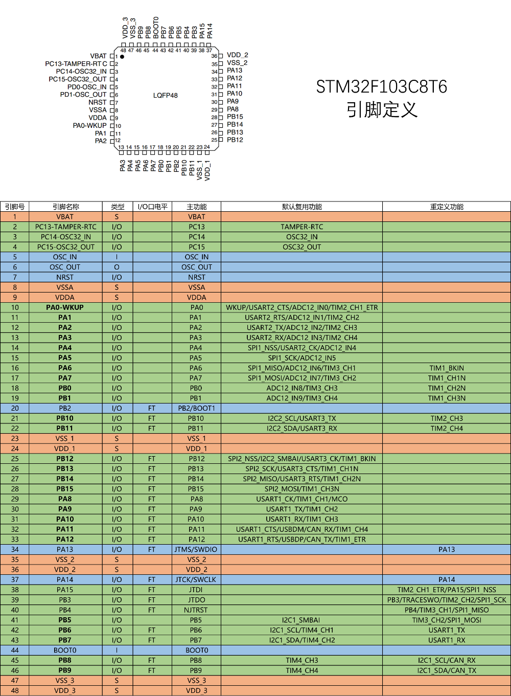
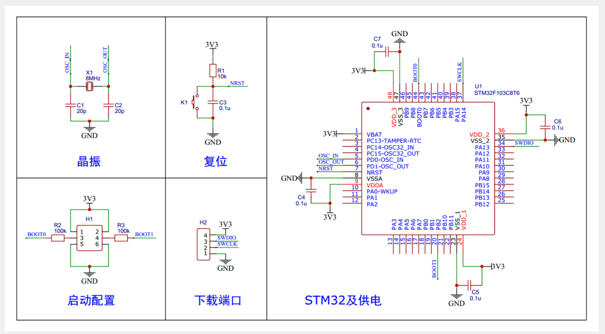

# STM32F103C8T6-扩展板 

### 软件代码库(验证过了)

[STM32F103C8T6-exBorad: STM32F103C8T6扩展板（硬件验证） \(gitee.com\)](https://gitee.com/its-a-slap/STM32F103C8T6-exBorad)

###  项目介绍

### 硬件更新记录

| 时间Time | 更新内容 | 说明                                                         |
| -------- | -------- | ------------------------------------------------------------ |
| 23-11-13 |          | 第一版硬件mpu6050和无源蜂鸣器重复使用了同一个端口，导致mpu6050测试的数据不太准确，旋转编码器取消了下拉电阻 |
|          |          |                                                              |
|          |          |                                                              |

### 软件更新记录

| 时间Time      | 更新内容                                 | 说明 |
| ------------- | ---------------------------------------- | ---- |
| 23-12-17      | OLED显示屏,PWM驱动舵机,继电器,无源蜂鸣器 |      |
| 23-12-18      | LED闪烁,按键控制LED,旋转编码器           |      |
| 23-12-25      | OLED显示屏-HX711                         |      |
| 24-1-31       | 对射式红外传感器计次                     |      |
| 24-2-3        | 2路串口输出                              |      |
| 24-2-05       | WS2812B                                  |      |
| 2024年2月16日 | AD单通道，AD多通道                       |      |
| 2024年2月17日 | 软件I2C，硬件I2C,软件SPI,硬件SPI         |      |
| 2024年3月1日  | OLED更新中文取模                         |      |
| 2024年3月2日  | 更新MPU6050-DMP库                        |      |
|               |                                          |      |

## 硬件成本

| 日期       | 链接                                                         | 链接                                                         | 金额 |
| ---------- | ------------------------------------------------------------ | ------------------------------------------------------------ | ---- |
| 2022-09-06 |  | https://item.taobao.com/item.htm?spm=a1z09.2.0.0.76c72e8diCtTXZ&id=620064088112&_u=72teeq1c0983 | 9.2  |
| 2023-11-17 |  | https://item.taobao.com/item.htm?spm=a1z09.2.0.0.76c72e8diCtTXZ&id=554291566489&_u=72teeq1ca1ab | 2.7  |
| 2023-11-12 |  | https://item.taobao.com/item.htm?spm=a1z09.2.0.0.76c72e8diCtTXZ&id=693325195287&_u=72teeq1c8c00 | 1.43 |
| 2021-07-08 |  | https://item.taobao.com/item.htm?spm=a1z09.2.0.0.76c72e8diCtTXZ&id=562145367495&_u=72teeq1c09a1 | 12   |
| 23-11-05   |  | https://item.taobao.com/item.htm?spm=a1z09.2.0.0.76c72e8diCtTXZ&id=696015063073&_u=72teeq1cdc85 | 1.82 |
| 23-11-12   |  | [矮体 通用无源蜂鸣器 电磁式 阻抗16欧 直流电阻16欧 (5个)-tmall.com天猫](https://detail.tmall.com/item.htm?_u=72teeq1ccd11&id=41297077381&spm=a1z09.2.0.0.76c72e8diCtTXZ) | 1.87 |
| 23-11-14   |  | https://item.taobao.com/item.htm?spm=a1z09.2.0.0.76c72e8diCtTXZ&id=686018450822&_u=72teeq1c4583 | 1.25 |
| 23-11-12   |  | [原装正品 贴片 W25Q128JVSIQ SOIC-8 128Mbit FLASH存储器芯片-淘宝网 (taobao.com)](https://item.taobao.com/item.htm?spm=a1z09.2.0.0.76c72e8diCtTXZ&id=564591570051&_u=72teeq1c3a8c) | 3.93 |
| 23-07-16   |  | [商品详情 (tmall.com)](https://detail.tmall.com/item.htm?id=674326140215&spm=a1z09.2.0.0.76c72e8dJBSJ3T&_u=72teeq1c512d) | 7.68 |
|            |                                                              |                                                              |      |
|            |                                                              |                                                              |      |
|            |                                                              |                                                              |      |
|            |                                                              |                                                              |      |
|            |                                                              |                                                              |      |
|            |                                                              |                                                              |      |
|            |                                                              |                                                              |      |
|            |                                                              |                                                              |      |

总金额大概为：

###  更新记录

### 实物图

###  主要功能

### 最小系统板

##  总结