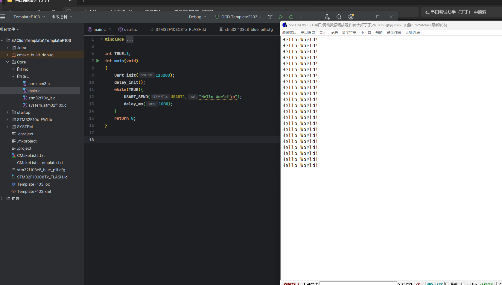

# STM32F103C8T6-扩展板（第一版）


## 项目介绍


## 编译成功





---


```c

#define PROID			"EZ7KmXf7Og"

#define ACCESS_KEY		"YlNKQU93YVhndVdPOHJUVk4wOExMaVJTUHRQSUJxTTY="

#define DEVICE_NAME		"24y3m24d"
```


## 测试

在onenet创建设备


### 模拟数据上传


```c
products/EZ7KmXf7Og/devices/24y3m24d
```


```c
YlNKQU93YVhndVdPOHJUVk4wOExMaVJTUHRQSUJxTTY=
```


```c

version=2018-10-31&res=products%2FEZ7KmXf7Og%2Fdevices%2F24y3m24d&et=1961857169&method=md5&sign=GTVAOuL0SFXqDjFtKN3JAg%3D%3D


```


```

$sys/EZ7KmXf7Og/24y3m24d/thing/property/post
```


```c

{
	"id": "123",
	"version": "1.0",
	"params": {
		"humi": {
			"value": 23
		},
		"temp": {
			"value": 23
		},
		"led": {
			"value": true
		}
		
	}
}
```

再加上其他属性试一下


```c

{
	"id": "123",
	"version": "1.0",
	"params": {
		"humi": {
			"value": 23
		},
		"temp": {
			"value": 23
		},
        "Light": {
			"value": 56
		},
		"led": {
			"value": true
		},
        "servo": {
			"value": 88
		},

        "beep": {
			"value": false
		}
		
	}
}
```


### 订阅上报回传

```
$sys/EZ7KmXf7Og/24y3m24d/thing/property/post/reply

```


### 真机数据上传成功


